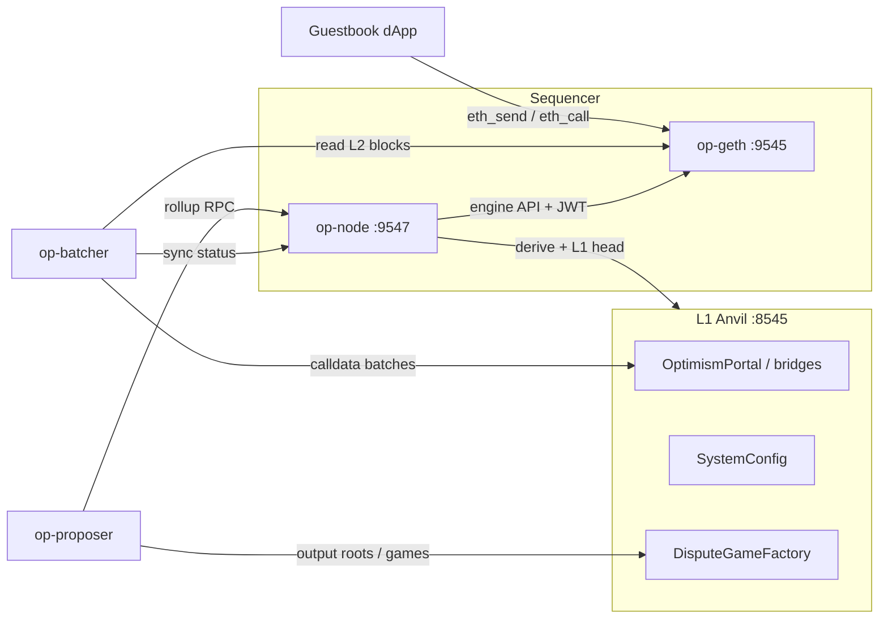

# ForteL2 — Phase 1 OP Stack learning rollup

Personal OP Stack L2 on a single Apple Silicon Mac, for learning only. **Native binaries only** — no Docker, OrbStack, or Kurtosis on this host (Phase 0 verdict; see `tasks/spike-notes.md`).

## Locked decisions (Phase 1)

| Choice | Value |
|---|---|
| L1 | Anvil (Foundry), chain ID **900** |
| L2 | op-geth + op-node sequencer, chain ID **901** |
| Deploy | native `op-deployer` → live Anvil |
| DA | **calldata** batches (`--data-availability-type=calldata`) — Anvil has no beacon/blobs |
| EL | **op-geth** (`--l2.enginekind=geth`) — verified arm64 in Phase 0 |
| L1 / L2 block time | **both 2s** (`L1_BLOCK_TIME` must be ≥ `L2_BLOCK_TIME`) |
| Explorer | `cast` / RPC only — Blockscout deferred |

## Toolchain versions

| Tool | Version | Notes |
|---|---|---|
| Go | 1.26.5 (`darwin/arm64`) | Homebrew |
| just | 1.56.0 | Homebrew |
| yq | 4.53.3 | Homebrew |
| jq | 1.8.2 | Homebrew |
| Foundry (`forge`/`cast`/`anvil`) | 1.7.1 | `foundryup` |
| optimism monorepo | `op-node/v1.19.2` (`da197e45…`) | `~/src/fortel2/optimism` |
| op-geth | `v1.101702.2` | `~/src/fortel2/op-geth` |
| op-deployer | `0.7.1` (release binary) | `~/src/fortel2/bin/op-deployer` |

Source trees and **runtime data** live under `~/src/fortel2/` (outside Dropbox). This repo symlinks binaries via `./bin/`. `DATA_DIR` defaults to `~/src/fortel2/data` so Anvil state / op-geth datadir are not Dropbox-synced.

**No Docker / OrbStack / Kurtosis** for Phase 1 on this workstation.

## Topology



## Roles (who does what)

- **op-geth** — L2 execution client (EVM, state, tx pool). Engine API on `:9551`.
- **op-node** — consensus / derivation / sequencing. With `--sequencer.enabled` it builds L2 blocks and drives op-geth. `--l2.enginekind=geth`.
- **op-batcher** — compresses L2 tx data into frames and posts them to L1 (here: calldata to the batch inbox).
- **op-proposer** — posts L2 output roots to L1 via DisputeGameFactory so withdrawals can later be proven (Phase 1b).

## Quick start

```bash
cp .env.example .env          # throwaway Anvil keys — never real funds
chmod +x scripts/*.sh
./scripts/start-all.sh        # L1 → deploy (first time) → sequencer → batcher → proposer
./scripts/status.sh
./scripts/smoke-transfer.sh   # L2 ETH transfer between genesis accounts
./scripts/deploy-guestbook.sh
./scripts/serve-dapp.sh       # http://127.0.0.1:8080
```

Stop / reset:

```bash
./scripts/stop-all.sh         # keep datadir + contracts
./scripts/reset.sh            # wipe everything → next start redeploys
```

Cold start from nothing: install toolchain (below) → `cp .env.example .env` → `./scripts/start-all.sh`.

## Toolchain install (once)

```bash
brew install go just yq jq
curl -L https://foundry.paradigm.xyz | bash && foundryup

mkdir -p ~/src/fortel2 && cd ~/src/fortel2
git clone --depth 1 --branch op-node/v1.19.2 https://github.com/ethereum-optimism/optimism.git
git clone --depth 1 --branch v1.101702.2 https://github.com/ethereum-optimism/op-geth.git

cd optimism
git submodule update --init --recursive
just build-superchain-go
just op-node && just op-batcher && just op-proposer

cd ../op-geth && make geth

# op-deployer: release binary (monorepo forge build wants forge 1.2.3)
curl -L -o /tmp/op-deployer.tgz \
  https://github.com/ethereum-optimism/optimism/releases/download/op-deployer/v0.7.1/op-deployer-0.7.1-darwin-arm64.tar.gz
tar -xzf /tmp/op-deployer.tgz -C /tmp
mkdir -p ~/src/fortel2/bin
cp /tmp/op-deployer-0.7.1-darwin-arm64/op-deployer ~/src/fortel2/bin/
ln -sfn ~/src/fortel2/optimism/op-node/bin/op-node ~/src/fortel2/bin/op-node
ln -sfn ~/src/fortel2/optimism/op-batcher/bin/op-batcher ~/src/fortel2/bin/op-batcher
ln -sfn ~/src/fortel2/optimism/op-proposer/bin/op-proposer ~/src/fortel2/bin/op-proposer
ln -sfn ~/src/fortel2/op-geth/build/bin/geth ~/src/fortel2/bin/op-geth
```

## Endpoints

| Service | URL |
|---|---|
| L1 RPC | `http://127.0.0.1:8545` (chain 900) |
| L2 RPC | `http://127.0.0.1:9545` (chain 901) |
| op-node RPC | `http://127.0.0.1:9547` |
| dApp | `http://127.0.0.1:8080` |

Prefunded L1/L2 accounts use the Foundry test mnemonic (`test test … junk`). Keys are in `.env.example`.

**L2 funding quirk:** `fundDevAccounts = true` funds many Anvil-style accounts on L2, but **not** account 0 (`ADMIN_ADDRESS` / `0xf39F…`). Use `DEMO_A` / `DEMO_B` (or batcher/proposer/sequencer keys) for L2 txs. Account 0 remains the L1 deployer and stays richly funded on L1.

## `rollup.json` in plain words

After deploy, `deployments/.deployer/rollup.json` tells op-node how this L2 relates to L1:

- **`l1_chain_id` / `l2_chain_id`** — which L1 we settle on (900) and our L2 identity (901).
- **`block_time`** — seconds between L2 blocks (2).
- **`batch_inbox_address`** — L1 address the batcher sends compressed tx data to.
- **`deposit_contract_address`** — OptimismPortal on L1 (deposits; Phase 1b).
- **`genesis`** — L2 genesis hash/number/time and system config snapshot (batcher address, gas limits, etc.).

## What is inside a batch? (US-005)

The batcher watches L2 blocks, packs their transactions into **channels** of compressed **frames**, and submits those frames to L1 (here as ordinary calldata txs to the batch inbox). Anyone with the L1 history can re-run the **derivation pipeline** (what op-node does in verifier mode) and rebuild the same L2 chain. That is what “the L2 is derivable from L1” means: L1 data availability, not L2 peer sync, is the source of truth for reconstructing state.

### Observed: stop batcher 5 minutes, then restart (US-005)

Ran on this chain (2026-07-18): kill `op-batcher` only, leave sequencer + Anvil running, sample every 30s, then `./scripts/05-start-batcher.sh`.

| Phase | What happened |
|---|---|
| During stop (~5 min) | **Batcher L1 nonce frozen** at 49 (no new batch txs). **Unsafe L2 kept advancing** (~308 → 459). **Safe L2 stuck** at 296 — derivation cannot promote new unsafe blocks without fresh L1 data. |
| On restart | Batcher immediately closed a **catch-up channel** covering the backlog (~164 L2 blocks, ~12KB compressed calldata, gas ~498k vs normal ~41k). Nonce resumed climbing (49 → 57 in ~90s). **Safe L2 climbed** toward the tip (296 → 496) as frames landed and op-node derived them. |

Takeaway: stopping the batcher does **not** stop the sequencer; it only pauses L1 data availability. Restart recovers by posting a larger backlog batch, then resumes steady-state cadence.

Reproduce:

```bash
# baseline
cast nonce "$BATCHER_ADDRESS" --rpc-url "$L1_RPC_URL"
cast rpc optimism_syncStatus --rpc-url "$L2_NODE_RPC_URL" | jq '{unsafe:.unsafe_l2.number, safe:.safe_l2.number}'

# stop only the batcher
kill "$(cat "$DATA_DIR/pids/op-batcher.pid")" && rm -f "$DATA_DIR/pids/op-batcher.pid"
# wait ~5 minutes; watch nonce stay flat while unsafe L2 rises and safe L2 stalls

# restart
./scripts/05-start-batcher.sh
# watch nonce rise again and safe head catch up; log: "Publishing transaction" / "Channel closed"
```

Inspect batcher activity anytime:

```bash
cast nonce 0x70997970C51812dc3A010C7d01b50e0d17dc79C8 --rpc-url http://127.0.0.1:8545
# rising nonce ⇒ batch txs submitted
```

## Proposer trust model (US-006)

On this solo learning chain the proposer key is trusted: whatever output root it posts to the DisputeGameFactory is what L1 will treat as the L2 tip for withdrawals. There is no independent challenger watching for lies (that is Phase 7 / fault proofs). Fault proofs would let anyone dispute a bad root inside a challenge window instead of trusting a single proposer key.

Read games / factory (addresses in `deployments/deployments.json`):

```bash
FACTORY=$(jq -r .DisputeGameFactoryProxy deployments/deployments.json)
cast call "$FACTORY" "gameCount()(uint256)" --rpc-url http://127.0.0.1:8545
```

On Anvil, L2 finality never advances the way it does on a real L1, so the proposer is started with `--allow-non-finalized` and proposes against the **safe** head (after batches land) rather than waiting for finalized.
## Chain inspection without Blockscout (US-007)

```bash
# Tip
cast block-number --rpc-url http://127.0.0.1:9545

# Recent block
cast block latest --rpc-url http://127.0.0.1:9545

# Tx by hash
cast tx <TX_HASH> --rpc-url http://127.0.0.1:9545
cast receipt <TX_HASH> --rpc-url http://127.0.0.1:9545

# Contract read
cast call <ADDR> "count()(uint256)" --rpc-url http://127.0.0.1:9545

# Balance
cast balance 0x9965507D1a55bcC2695C58ba16FB37d819B0A4dc --rpc-url http://127.0.0.1:9545
```

Blockscout (and any docker-compose explorer) is **explicitly deferred** on this host.

## MetaMask (US-008)

Add network:

- Network name: `ForteL2`
- RPC URL: `http://127.0.0.1:9545`
- Chain ID: `901`
- Currency: `ETH`

Import a throwaway key from `.env` that is L2-funded (e.g. `DEMO_A_PRIVATE_KEY` — **not** `ADMIN_PRIVATE_KEY`, which has 0 L2 balance). Genesis funding comes from `fundDevAccounts = true` in the deployer intent — **no bridge in Phase 1**.

Guestbook contract (current deploy): see `deployments/guestbook.txt` / `dapp/config.js`. Serve UI:

```bash
./scripts/serve-dapp.sh   # http://127.0.0.1:8080
```

If MetaMask shows a stuck/failed tx after a chain reset: **Settings → Developer tools → Delete activity and nonce data** (clears local nonce history; older UIs called this Advanced → Reset account), hard-refresh the dapp, then Sign again with `DEMO_A`.

### Why L1 block time must match L2

With Fjord active from genesis, op-node caps sequencer drift at a **constant 1800s** (not `max_sequencer_drift` in rollup.json). Origin advances at most one L1 block per L2 block. If L1 is faster than L2 (e.g. Anvil 1s vs L2 2s), drift grows ~1s/block; past 1800s the sequencer sets `NoTxPool` and only deposit txs land — MetaMask/user txs hang forever. Keep `L1_BLOCK_TIME >= L2_BLOCK_TIME` (both `2` here). If drift is already past the cap, `./scripts/reset.sh` then `./scripts/start-all.sh`.

## Logs & health lines

| Component | Log file | Known-good line |
|---|---|---|
| Anvil | `data/logs/anvil.log` | `Listening on 127.0.0.1:8545` |
| op-geth | `data/logs/op-geth.log` | `HTTP server started` / `Opened legacy database` |
| op-node | `data/logs/op-node.log` | `Created new L2 block` / `Sequencer` |
| op-batcher | `data/logs/op-batcher.log` | `publishing` / `Submit` / `Sent transaction` |
| op-proposer | `data/logs/op-proposer.log` | `dispute game` / `Proposing` |

## Sequencer restart

`./scripts/stop-all.sh` then `./scripts/start-all.sh` (without `reset.sh`) resumes from the existing op-geth datadir — no re-genesis. Deploy artifacts are reused.

## Phase roadmap status

See `tasks/prd-l2-learning-chain.md`. Phase 0 done; Phase 1 is this runbook; Phase 1b adds bridging.
