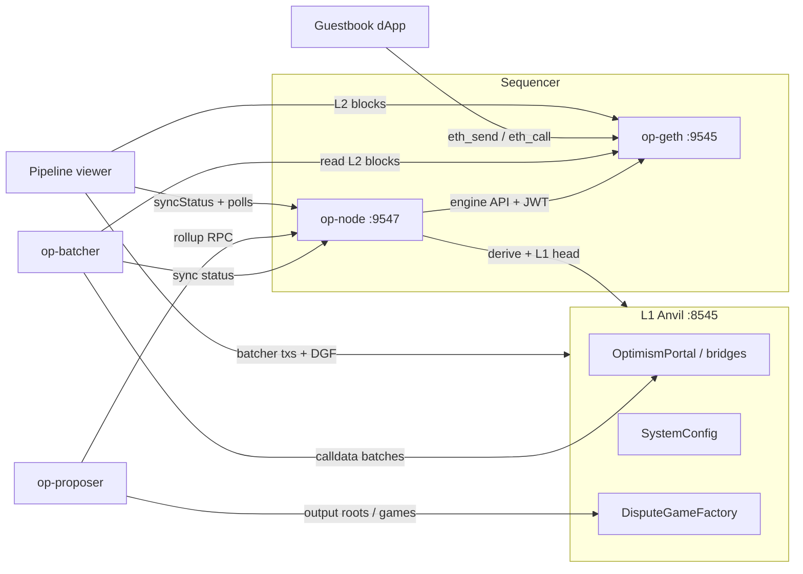

# ForteL2 — Phase 1 OP Stack learning rollup

Personal OP Stack L2 on a single Apple Silicon Mac, for learning only. **Native binaries only** — no Docker, OrbStack, or Kurtosis on this host (Phase 0 verdict; see `tasks/spike-notes.md`).

## Locked decisions (Phase 1)

| Choice | Value |
|---|---|
| L1 | Anvil (Foundry), chain ID **900** |
| L2 | op-geth + op-node sequencer, chain ID **901** |
| Deploy | native `op-deployer` → live Anvil |
| DA | **calldata** batches (`--data-availability-type=calldata`) — Anvil has no beacon/blobs |
| EL | **op-geth** (`--l2.enginekind=geth`) — verified arm64 in Phase 0 |
| L1 / L2 block time | **both 2s** (`L1_BLOCK_TIME` must be ≥ `L2_BLOCK_TIME`) |
| Explorer | `cast` / RPC + Phase 1c **pipeline viewer** — Blockscout / hosted explorers deferred |

## Toolchain versions

| Tool | Version | Notes |
|---|---|---|
| Go | 1.26.5 (`darwin/arm64`) | Homebrew |
| just | 1.56.0 | Homebrew |
| yq | 4.53.3 | Homebrew |
| jq | 1.8.2 | Homebrew |
| Foundry (`forge`/`cast`/`anvil`) | 1.7.1 | `foundryup` |
| optimism monorepo | `op-node/v1.19.2` (`da197e45…`) | `~/src/fortel2/optimism` |
| op-geth | `v1.101702.2` | `~/src/fortel2/op-geth` |
| op-deployer | `0.7.1` (release binary) | `~/src/fortel2/bin/op-deployer` |

Source trees and **runtime data** live under `~/src/fortel2/` (outside Dropbox). This repo symlinks binaries via `./bin/`. `DATA_DIR` defaults to `~/src/fortel2/data` so Anvil state / op-geth datadir are not Dropbox-synced.

**No Docker / OrbStack / Kurtosis** for Phase 1 on this workstation.

## Topology



## Roles (who does what)

- **op-geth** — L2 execution client (EVM, state, tx pool). Engine API on `:9551`.
- **op-node** — consensus / derivation / sequencing. With `--sequencer.enabled` it builds L2 blocks and drives op-geth. `--l2.enginekind=geth`.
- **op-batcher** — compresses L2 tx data into frames and posts them to L1 (here: calldata to the batch inbox).
- **op-proposer** — posts L2 output roots to L1 via DisputeGameFactory so withdrawals can later be proven (Phase 1b).

## Quick start

```bash
cp .env.example .env          # throwaway Anvil keys — never real funds
chmod +x scripts/*.sh
./scripts/start-all.sh        # L1 → deploy (first time) → sequencer → batcher → proposer
./scripts/status.sh
./scripts/smoke-transfer.sh   # L2 ETH transfer between genesis accounts
./scripts/deposit-eth.sh      # Phase 1b: L1→L2 ETH via Standard Bridge (ADMIN)
./scripts/withdraw-initiate.sh && ./scripts/withdraw-prove.sh && ./scripts/withdraw-finalize.sh
./scripts/deploy-guestbook.sh
./scripts/serve-dapp.sh       # http://127.0.0.1:8080
./scripts/serve-viewer.sh     # http://127.0.0.1:8081 pipeline viewer (Phase 1c)
./scripts/demo-checklist.sh   # operator demo: auto smokes + human checklist
```

### Tests / merge guardrails

```bash
export PATH="$HOME/.foundry/bin:$PATH"
cd contracts && forge test          # Guestbook unit + fuzz tests
./scripts/test-helpers.sh          # address / loopback / block-time / key-tripwire / viewer config
node --test viewer/lib.test.js     # pipeline viewer pure helpers
```

GitHub Actions runs the same trio on every PR (`.github/workflows/ci.yml`). Startup scripts hard-fail if `L1_BLOCK_TIME < L2_BLOCK_TIME` or RPCs leave loopback. Broadcast scripts refuse Foundry default keys when `L2_CHAIN_ID != 901`.

Agent workflow notes live in `AGENTS.md`. `scripts/lib.sh` process helpers (`start_bg` / `stop_bg`) are privileged — see `.github/CODEOWNERS`. `serve_static_loopback` is not privileged process control.
Stop / reset:

```bash
./scripts/stop-all.sh         # keep datadir + contracts
./scripts/reset.sh            # wipe everything → next start redeploys
```

Cold start from nothing: install toolchain (below) → `cp .env.example .env` → `./scripts/start-all.sh`.

## Toolchain install (once)

```bash
brew install go just yq jq
curl -L https://foundry.paradigm.xyz | bash && foundryup

mkdir -p ~/src/fortel2 && cd ~/src/fortel2
git clone --depth 1 --branch op-node/v1.19.2 https://github.com/ethereum-optimism/optimism.git
git clone --depth 1 --branch v1.101702.2 https://github.com/ethereum-optimism/op-geth.git

cd optimism
git submodule update --init --recursive
just build-superchain-go
just op-node && just op-batcher && just op-proposer

cd ../op-geth && make geth

# op-deployer: release binary (monorepo forge build wants forge 1.2.3)
curl -L -o /tmp/op-deployer.tgz \
  https://github.com/ethereum-optimism/optimism/releases/download/op-deployer/v0.7.1/op-deployer-0.7.1-darwin-arm64.tar.gz
tar -xzf /tmp/op-deployer.tgz -C /tmp
mkdir -p ~/src/fortel2/bin
cp /tmp/op-deployer-0.7.1-darwin-arm64/op-deployer ~/src/fortel2/bin/
ln -sfn ~/src/fortel2/optimism/op-node/bin/op-node ~/src/fortel2/bin/op-node
ln -sfn ~/src/fortel2/optimism/op-batcher/bin/op-batcher ~/src/fortel2/bin/op-batcher
ln -sfn ~/src/fortel2/optimism/op-proposer/bin/op-proposer ~/src/fortel2/bin/op-proposer
ln -sfn ~/src/fortel2/op-geth/build/bin/geth ~/src/fortel2/bin/op-geth
```

## Endpoints

| Service | URL |
|---|---|
| L1 RPC | `http://127.0.0.1:8545` (chain 900) |
| L2 RPC | `http://127.0.0.1:9545` (chain 901) |
| op-node RPC | `http://127.0.0.1:9547` |
| dApp | `http://127.0.0.1:8080` |
| Pipeline viewer | `http://127.0.0.1:8081` |

Prefunded L1/L2 accounts use the Foundry test mnemonic (`test test … junk`). Keys are in `.env.example`.

**L2 funding quirk:** `fundDevAccounts = true` funds many Anvil-style accounts on L2, but **not** account 0 (`ADMIN_ADDRESS` / `0xf39F…`). Use `DEMO_A` / `DEMO_B` (or batcher/proposer/sequencer keys) for L2 txs. Account 0 remains the L1 deployer and stays richly funded on L1 — which makes it the natural sender for Phase 1b deposits.

## Deposits L1 → L2 (US-010)

```bash
./scripts/deposit-eth.sh
# optional: DEPOSIT_AMOUNT=0.25ether ./scripts/deposit-eth.sh
```

This calls `L1StandardBridge.bridgeETH` from **ADMIN** (rich on L1, zero on L2 at genesis). op-node derives a **deposit transaction** onto L2; the script prints the L1 tx hash and waits until ADMIN’s L2 balance rises.

**How deposits differ from normal L2 txs:** a MetaMask / `smoke-transfer.sh` tx enters the sequencer mempool and can be reordered or censored by the sequencer. A deposit is an L1 transaction to the portal/bridge; the derivation pipeline **must** include it in an L2 block. The sequencer cannot drop it without stalling derivation. That is why deposits are the censorship-resistant ingress path even on a centralized sequencer.

## Withdrawals L2 → L1 (US-011)

Full path (three txs): **initiate on L2 → prove on L1 → finalize on L1**.

```bash
# After a deposit (ADMIN needs L2 ETH), with proposer running:
./scripts/withdraw-initiate.sh    # L2ToL1MessagePasser.initiateWithdrawal
./scripts/withdraw-prove.sh       # wait for dispute game + OptimismPortal.proveWithdrawalTransaction
./scripts/withdraw-finalize.sh    # resolve game if needed, wait/warp delays, finalizeWithdrawalTransaction
./scripts/verify-portal-delays.sh # inspect portal immutables
```

Artifacts land in `$DATA_DIR/bridge/last-withdrawal.json` (L2 + prove + finalize hashes). Prove/finalize use a small Node helper under [`scripts/bridge/`](scripts/bridge/) (`viem` op-stack actions; `npm ci` on first run).

### Shortened challenge window (local only)

`scripts/02-deploy-contracts.sh` writes op-deployer `[globalDeployOverrides]`:

| Intent / env knob | Default (local) | Mainnet-scale |
|---|---|---|
| `proofMaturityDelaySeconds` (`PROOF_MATURITY_DELAY_SECONDS`) | **12** | 604800 (7d) |
| `disputeGameFinalityDelaySeconds` (`DISPUTE_GAME_FINALITY_DELAY_SECONDS`) | **6** | 302400 (3.5d) |
| `faultGameMaxClockDuration` | **10** | hours+ |
| `faultGameWithdrawalDelay` | **1** | longer |

These are portal/game **immutables** — changing them requires `./scripts/reset.sh` then `./scripts/start-all.sh` (redeploy). If your `op-deployer` build ignores the overrides ([optimism#14869](https://github.com/ethereum-optimism/optimism/issues/14869)), `verify-portal-delays.sh` warns and `withdraw-finalize.sh` **Anvil time-warps** (`evm_increaseTime`) using the portal’s on-chain delays and the dispute game’s on-chain `maxClockDuration` (not just `.env` defaults) so the learning path still completes in one sitting.

**Why mainnet uses ~7 days:** the prove→finalize delay is the window for an honest party to challenge a bad output root before funds leave L1. On this solo learning chain the proposer key is trusted (no `op-challenger`); shortening the window is for operator ergonomics only. Fault proofs (Phase 7) are what replace “trust the proposer” with “anyone can dispute.”

## `rollup.json` in plain words

After deploy, `deployments/.deployer/rollup.json` tells op-node how this L2 relates to L1:

- **`l1_chain_id` / `l2_chain_id`** — which L1 we settle on (900) and our L2 identity (901).
- **`block_time`** — seconds between L2 blocks (2).
- **`batch_inbox_address`** — L1 address the batcher sends compressed tx data to.
- **`deposit_contract_address`** — OptimismPortal on L1 (deposits; Phase 1b).
- **`genesis`** — L2 genesis hash/number/time and system config snapshot (batcher address, gas limits, etc.).

## What is inside a batch? (US-005)

The batcher watches L2 blocks, packs their transactions into **channels** of compressed **frames**, and submits those frames to L1 (here as ordinary calldata txs to the batch inbox). Anyone with the L1 history can re-run the **derivation pipeline** (what op-node does in verifier mode) and rebuild the same L2 chain. That is what “the L2 is derivable from L1” means: L1 data availability, not L2 peer sync, is the source of truth for reconstructing state.

### Observed: stop batcher 5 minutes, then restart (US-005)

Ran on this chain (2026-07-18): kill `op-batcher` only, leave sequencer + Anvil running, sample every 30s, then `./scripts/05-start-batcher.sh`.

| Phase | What happened |
|---|---|
| During stop (~5 min) | **Batcher L1 nonce frozen** at 49 (no new batch txs). **Unsafe L2 kept advancing** (~308 → 459). **Safe L2 stuck** at 296 — derivation cannot promote new unsafe blocks without fresh L1 data. |
| On restart | Batcher immediately closed a **catch-up channel** covering the backlog (~164 L2 blocks, ~12KB compressed calldata, gas ~498k vs normal ~41k). Nonce resumed climbing (49 → 57 in ~90s). **Safe L2 climbed** toward the tip (296 → 496) as frames landed and op-node derived them. |

Takeaway: stopping the batcher does **not** stop the sequencer; it only pauses L1 data availability. Restart recovers by posting a larger backlog batch, then resumes steady-state cadence.

Reproduce:

```bash
# baseline
cast nonce "$BATCHER_ADDRESS" --rpc-url "$L1_RPC_URL"
cast rpc optimism_syncStatus --rpc-url "$L2_NODE_RPC_URL" | jq '{unsafe:.unsafe_l2.number, safe:.safe_l2.number}'

# stop only the batcher
kill "$(cat "$DATA_DIR/pids/op-batcher.pid")" && rm -f "$DATA_DIR/pids/op-batcher.pid"
# wait ~5 minutes; watch nonce stay flat while unsafe L2 rises and safe L2 stalls

# restart
./scripts/05-start-batcher.sh
# watch nonce rise again and safe head catch up; log: "Publishing transaction" / "Channel closed"
```

Inspect batcher activity anytime:

```bash
cast nonce 0x70997970C51812dc3A010C7d01b50e0d17dc79C8 --rpc-url http://127.0.0.1:8545
# rising nonce ⇒ batch txs submitted
```

## Proposer trust model (US-006)

On this solo learning chain the proposer key is trusted: whatever output root it posts to the DisputeGameFactory is what L1 will treat as the L2 tip for withdrawals. There is no independent challenger watching for lies (that is Phase 7 / fault proofs). Fault proofs would let anyone dispute a bad root inside a challenge window instead of trusting a single proposer key.

Read games / factory (addresses in `deployments/deployments.json`):

```bash
FACTORY=$(jq -r .DisputeGameFactoryProxy deployments/deployments.json)
cast call "$FACTORY" "gameCount()(uint256)" --rpc-url http://127.0.0.1:8545
```

On Anvil, L2 finality never advances the way it does on a real L1, so the proposer is started with `--allow-non-finalized` and proposes against the **safe** head (after batches land) rather than waiting for finalized.
## Chain inspection without Blockscout (US-007)

```bash
# Tip
cast block-number --rpc-url http://127.0.0.1:9545

# Recent block
cast block latest --rpc-url http://127.0.0.1:9545

# Tx by hash
cast tx <TX_HASH> --rpc-url http://127.0.0.1:9545
cast receipt <TX_HASH> --rpc-url http://127.0.0.1:9545

# Contract read
cast call <ADDR> "count()(uint256)" --rpc-url http://127.0.0.1:9545

# Balance
cast balance 0x9965507D1a55bcC2695C58ba16FB37d819B0A4dc --rpc-url http://127.0.0.1:9545
```

Blockscout / other containerized explorers, and hosted SaaS explorers (e.g. Ethernal), are **explicitly deferred** on this host until the Phase 1b non-loopback policy review allows a reachable RPC (or a container-capable host is used). Phase 1c’s **pipeline viewer** is the intentional learning UI — not a full explorer.

## Pipeline viewer (Phase 1c / US-013 / US-014)

Ops dashboard for the sequencer → batcher → proposer path. Client-side polls only (no indexer).

```bash
./scripts/serve-viewer.sh   # regenerates viewer/config.js, then http://127.0.0.1:8081/
# or: ./scripts/gen-viewer-config.sh && open the viewer after deploy
```

Stopping the viewer (Ctrl-C) does **not** stop the chain. Config is built from `.env` + `deployments/deployments.json` + `deployments/.deployer/rollup.json`.

| Panel | RPCs | What it shows |
|---|---|---|
| **Sequencer** | op-node `optimism_syncStatus`, L2 blocks | Unsafe / safe / finalized heads, lag, recent block interval |
| **Batcher** | L1 recent blocks | Posts from `BATCHER_ADDRESS` → batch inbox (last hash, age, cadence) |
| **Proposer** | L1 DisputeGameFactory | `gameCount`, latest game proxy / age / type |
| **Aggregate** | L2 recent blocks | Empty vs non-empty blocks, tx count, rough tx/min |

Refresh cadence defaults to **5s** (shown in the UI). Panel RPC failures surface as plain status text — panels do not silently go stale. After a deposit, watch L2 inclusion and sync heads; after a withdrawal initiate, you need proposer output before prove/finalize.

Guestbook (`:8080`) is the demo write path; the pipeline viewer (`:8081`) is the ops/learning surface. Neither is an address/tx search explorer.

## MetaMask (US-008)

Add network:

- Network name: `ForteL2`
- RPC URL: `http://127.0.0.1:9545`
- Chain ID: `901`
- Currency: `ETH`

Import a throwaway key from `.env` that is L2-funded (e.g. `DEMO_A_PRIVATE_KEY` — **not** `ADMIN_PRIVATE_KEY`, which has 0 L2 balance). Genesis funding comes from `fundDevAccounts = true` in the deployer intent — **no bridge in Phase 1**.

Guestbook contract (current deploy): see `deployments/guestbook.txt` / `dapp/config.js`. Serve UI:

```bash
./scripts/serve-dapp.sh   # http://127.0.0.1:8080
```

If MetaMask shows a stuck/failed tx after a chain reset: **Settings → Developer tools → Delete activity and nonce data** (clears local nonce history; older UIs called this Advanced → Reset account), hard-refresh the dapp, then Sign again with `DEMO_A`.

### Why L1 block time must match L2

With Fjord active from genesis, op-node caps sequencer drift at a **constant 1800s** (not `max_sequencer_drift` in rollup.json). Origin advances at most one L1 block per L2 block. If L1 is faster than L2 (e.g. Anvil 1s vs L2 2s), drift grows ~1s/block; past 1800s the sequencer sets `NoTxPool` and only deposit txs land — MetaMask/user txs hang forever. Keep `L1_BLOCK_TIME >= L2_BLOCK_TIME` (both `2` here). If drift is already past the cap, `./scripts/reset.sh` then `./scripts/start-all.sh`.

## Logs & health lines

| Component | Log file | Known-good line |
|---|---|---|
| Anvil | `data/logs/anvil.log` | `Listening on 127.0.0.1:8545` |
| op-geth | `data/logs/op-geth.log` | `HTTP server started` / `Opened legacy database` |
| op-node | `data/logs/op-node.log` | `Created new L2 block` / `Sequencer` |
| op-batcher | `data/logs/op-batcher.log` | `publishing` / `Submit` / `Sent transaction` |
| op-proposer | `data/logs/op-proposer.log` | `dispute game` / `Proposing` |

## Sequencer restart

`./scripts/stop-all.sh` then `./scripts/start-all.sh` (without `reset.sh`) resumes from the existing op-geth datadir — no re-genesis. Deploy artifacts are reused.

## Phase roadmap status

See `tasks/prd-l2-learning-chain.md`. Phase 0–1b done; **Phase 1c pipeline viewer is done** (loopback US-013 / US-014). Hosted explorers (e.g. Ethernal) stay deferred until a non-loopback RPC is deliberately allowed.

### Phase 2 readiness checklist (US-012 — complete in Phase 1b before Sepolia)

Do **not** start Phase 2 until all of these are true:

- [x] **Fresh keys / Foundry tripwire:** scripts that broadcast call `refuse_foundry_defaults_unless_local_l2` and fail closed when `L2_CHAIN_ID != 901` if a Foundry/Anvil default private key is still configured. Before Sepolia: generate **new** keys (never fund or reuse the `.env.example` mnemonic accounts on a public net).
- [x] **Separate deploy tree (documented):** Phase 2 must **not** reuse the Phase 1 `.env` + `deployments/.deployer/` tree. Use a distinct env file (e.g. `.env.sepolia`) and deploy workdir (e.g. `deployments/sepolia/.deployer/`). Replaced artifacts: L1 contracts, L2 genesis/`rollup.json`, RPC URLs, chain IDs, funded accounts, JWT/engine secrets. Do not copy Phase 1 `deployments.json` to Sepolia.
- [x] **Non-loopback policy review (go/no-go):** **No-go for now.** All RPCs, batcher/proposer, and the dApp stay on `127.0.0.1` / `localhost` (enforced by `assert_loopback_url` / `assert_local_rpc_urls`). Exposing anything binds an unauthenticated JSON-RPC / HTTP surface to the LAN or internet — unacceptable until a later review names: what is exposed, to whom, auth model (e.g. Tailscale + no public bind), and rollback (rebind loopback + stop processes). Default remains loopback-only through Phase 1b.
- [x] **Sandbox / dry-run gate (prerequisite, not done yet):** Phase 2 cutover requires a **disposable Sepolia** deploy + dry-run of deposit/withdraw scripts first. Guestbook has **no** shadow/dual-write mode — do not invent one. This item is a hard gate before funding or “production” Sepolia use; execution is Phase 2 work.
- [x] **Agent-permission / tool-access audit (scheduled):** Phase 2 prerequisite — before Sepolia keys or non-loopback binds, audit which agents/tools may read `.env`, broadcast txs, or change bind addresses. Stub checklist: (1) no cloud agent with repo secrets for funded keys, (2) CODEOWNERS review for `scripts/lib.sh` `start_bg`/`stop_bg`, (3) confirm Foundry tripwire still on for non-901.
