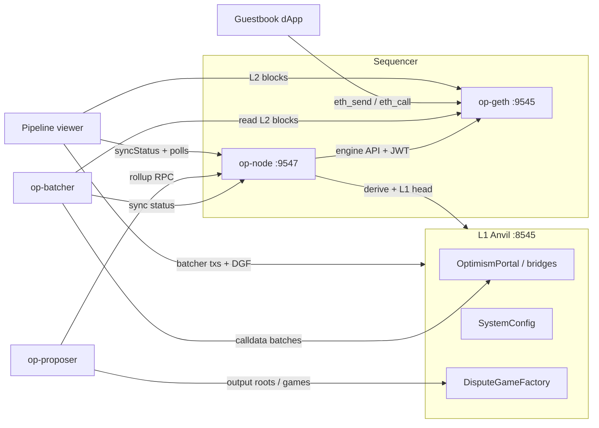

# ForteL2

A personal Ethereum Layer 2, built on the [OP Stack](https://docs.optimism.io/) to understand how rollups actually work — by running one, then rebuilding its components from scratch — with a tentative plan to eventually graduate the chain to Ethereum mainnet as a full-fledged L2.

The strategy is **run first, rebuild later**. The early phases stand up the real production OP Stack on a Mac mini against a local L1 devnet, so the full pipeline is observable end to end: L2 block production → batch submission to L1 → state root proposals. Later phases progressively replace individual components (batcher, proposer, derivation pipeline) with from-scratch reimplementations targeting the [OP Stack specs](https://github.com/ethereum-optimism/specs), migrate the L1 to Sepolia, add remote and friend-operated replica nodes, and explore fault proofs and decentralized sequencing.

**Phases 1–8 are learning phases**: no real funds, no external users, no uptime commitments. Mainnet (Phase 9) is a gated, tentative decision — it requires the learning phases to succeed and a geographically distributed set of friend-operated verifier nodes to exist first. The acceptance criteria throughout require explaining concepts in writing, not just keeping processes alive.

## Architecture

Base-style rollups don't have PoS validators. The roles here are:

| Component | Role | Implementation |
|---|---|---|
| **Sequencer** | Orders transactions, builds L2 blocks | op-node + op-geth (sequencer mode) |
| **Batcher** | Compresses L2 tx data, posts it to L1 | op-batcher → custom rebuild (Phase 4) |
| **Proposer** | Posts L2 state output roots to L1 | op-proposer → custom rebuild (Phase 5) |
| **Replica / verifier** | Derives the L2 independently from L1 data | stock op-node + EL (verifier mode); remote on Render, then friend-operated |
| **Pipeline viewer** | Loopback-only UI showing sequencer / batcher / proposer / mempool activity | DIY static UI polling RPC — deliberately not a full block explorer |

Everything runs as **native arm64 binaries** on a single Apple Silicon Mac mini — no Docker, no Kurtosis (see Design Decisions and `tasks/spike-notes.md`). Local L1 is Anvil; the demo dApp is a MetaMask-connected guestbook.

## Roadmap

| Phase | Scope | Status |
|---|---|---|
| **0** | Deployment-path spike: Kurtosis `optimism-package` vs. manual builds on Apple Silicon | ✅ Done — verdict: manual native builds |
| **1** | Full OP Stack devnet on the Mac mini: Anvil L1, op-deployer, sequencer, batcher, proposer, demo dApp | ✅ Done |
| **1b** | Bridging: L1→L2 deposits via the Standard Bridge; full L2→L1 withdrawals with a shortened challenge window; Phase 2 readiness gate | ✅ Done |
| **1c** | DIY pipeline viewer: live sequencer / batcher / proposer / tx activity panels on loopback | ✅ Done |
| **1d** | Viewer mempool signal + Sepolia funding and fresh-key gate | ✅ Done |
| **2a** | Sepolia scaffold: `.env.sepolia` tree, L2 chain **852**, public RPC, no on-chain spend | ✅ Done |
| **2b** | Disposable `op-deployer apply` on Sepolia + genesis under `deployments/sepolia/` | ✅ Done |
| **2c** | L2 against Sepolia L1 (short batcher/proposer run + deposit dry-run) | ✅ Done |
| **2d** | Dedicated L1 RPC via **QuickNode** (env swap; no redeploy) | ✅ Done |
| **3** | **Replica node on Render** — stock verifier, L1-derived sync ([fortel2-replica](https://github.com/StephenForte/fortel2-replica)) | ✅ Done |
| **3b** | **Friend-operated verifier nodes**: geographically distributed operators, onboarded on Sepolia first | Planned |
| **4** | **Reimplement the batcher** from scratch; swap out op-batcher | Planned |
| **5** | **Reimplement the proposer** from scratch; swap out op-proposer | Planned |
| **6** | **Reimplement the derivation pipeline** — the deepest rebuild | Planned |
| **3a** | Native Mac mini Sepolia L1 (optional; was 2e) — after 4–6 unless RPC forces earlier | Deferred |
| **7** | **Fault proofs**: run op-challenger, exercise a dispute game against a deliberately bad proposal | Planned |
| **8** | **Decentralized sequencer** exploration: multiple candidates, leader election | Planned |
| **9** | **Mainnet (tentative)**: graduate to Ethereum mainnet as L1, production key management, real ETH economics — gated on earlier phases + committed distributed node network | Decision not locked |

Canonical acceptance criteria: `tasks/prd-l2-learning-chain.md`.

## Design decisions

- **Native builds, no containers.** The Phase 0 spike attempted Kurtosis's `optimism-package`; OrbStack disrupted host networking and the enclave never stabilized, while op-node and op-geth built cleanly as native arm64 binaries. Verdict: manual builds from the optimism monorepo, orchestrated with shell scripts. No Docker on this workstation.
- **DIY pipeline viewer instead of Blockscout.** Hosted explorers need a non-loopback RPC; self-hosted ones need containers. Both violate current constraints, so the chain gets a purpose-built loopback UI that shows exactly what a learning operator needs — the sequencer→batcher→proposer pipeline and mempool — and nothing Etherscan-shaped.
- **Withdrawals in Phase 1b, not later.** The 7-day challenge window normally makes withdrawals a scope grenade, but a local devnet controls the finalization period — shortened, the full initiate→prove→finalize flow becomes a one-evening exercise. Cheap to learn locally, expensive to learn on Sepolia where the window can't be shortened.
- **Fault proofs deferred to Phase 7.** On a solo devnet with one trusted proposer there is no adversary; the dispute game is best learned after rebuilding the proposer (Phase 5), when output roots are understood from the inside.
- **Sepolia doesn't inherit the Phase 1 chain.** Phase 2 is a fresh contract deployment and fresh genesis — the local chain gets replaced, not migrated. The runbook is structured so redeployment is cheap.
- **Key hygiene as a phase gate.** Phase 2 requires fresh keys generated outside the repo — never Foundry defaults, never keys pasted into agent chats — and a funded Sepolia balance floor before sustained batcher/proposer operation.

## Success metrics

Cold start to producing L2 blocks in under 30 minutes from the runbook alone. The full pipeline — L2 tx → batch on L1 → output root on L1 — demonstrable in one sitting with `cast`. The operator can explain, without notes, what each OP Stack component does and what breaks when it stops.

## Notes

Built and operated as a solo project (for now — Phase 3b changes that). Related work: [settlementos](https://github.com/StephenForte/settlementos) and its [independent explorer](https://github.com/StephenForte/settlementos-explorer), deployed to Base Sepolia and Polygon Amoy.

---

# Operator runbook (Phase 1)

Phase 1 is a local OP Stack learning rollup on Apple Silicon. **Native binaries only** — no Docker, OrbStack, or Kurtosis on this host.

## Locked decisions (Phase 1)

| Choice | Value |
|---|---|
| L1 | Anvil (Foundry), chain ID **900** |
| L2 | op-geth + op-node sequencer, chain ID **901** |
| Deploy | native `op-deployer` → live Anvil |
| DA | **calldata** batches (`--data-availability-type=calldata`) — Anvil has no beacon/blobs |
| EL | **op-geth** (`--l2.enginekind=geth`) — verified arm64 in Phase 0 |
| L1 / L2 block time | **both 2s** (`L1_BLOCK_TIME` must be ≥ `L2_BLOCK_TIME`) |
| Explorer | `cast` / RPC + Phase 1c **pipeline viewer** — Blockscout / hosted explorers deferred |

## Toolchain versions

| Tool | Version | Notes |
|---|---|---|
| Go | 1.26.5 (`darwin/arm64`) | Homebrew |
| just | 1.56.0 | Homebrew |
| yq | 4.53.3 | Homebrew |
| jq | 1.8.2 | Homebrew |
| Foundry (`forge`/`cast`/`anvil`) | 1.7.1 | `foundryup` |
| optimism monorepo | `op-node/v1.19.2` (`da197e45…`) | `~/src/fortel2/optimism` |
| op-geth | `v1.101702.2` | `~/src/fortel2/op-geth` |
| op-deployer | `0.7.1` (release binary) | `~/src/fortel2/bin/op-deployer` |

Source trees and **runtime data** live under `~/src/fortel2/` (outside Dropbox). This repo symlinks binaries via `./bin/`. `DATA_DIR` defaults to `~/src/fortel2/data` so Anvil state / op-geth datadir are not Dropbox-synced.

**No Docker / OrbStack / Kurtosis** for Phase 1 on this workstation.

## Topology



## Roles (who does what)

- **op-geth** — L2 execution client (EVM, state, tx pool). Engine API on `:9551`.
- **op-node** — consensus / derivation / sequencing. With `--sequencer.enabled` it builds L2 blocks and drives op-geth. `--l2.enginekind=geth`.
- **op-batcher** — compresses L2 tx data into frames and posts them to L1 (here: calldata to the batch inbox).
- **op-proposer** — posts L2 output roots to L1 via DisputeGameFactory so withdrawals can later be proven (Phase 1b).

## Quick start

```bash
cp .env.example .env          # throwaway Anvil keys — never real funds
chmod +x scripts/*.sh
./scripts/start-all.sh        # L1 → deploy (first time) → sequencer → batcher → proposer
./scripts/status.sh
./scripts/smoke-transfer.sh   # L2 ETH transfer between genesis accounts
./scripts/deposit-eth.sh      # Phase 1b: L1→L2 ETH via Standard Bridge (ADMIN)
./scripts/withdraw-initiate.sh && ./scripts/withdraw-prove.sh && ./scripts/withdraw-finalize.sh
./scripts/deploy-guestbook.sh
./scripts/serve-dapp.sh       # http://127.0.0.1:8080
./scripts/serve-viewer.sh     # http://127.0.0.1:8081 pipeline viewer (Phase 1c)
./scripts/demo-checklist.sh   # operator demo: auto smokes + human checklist
```

### Tests / merge guardrails

```bash
export PATH="$HOME/.foundry/bin:$PATH"
cd contracts && forge test          # Guestbook unit + fuzz tests
./scripts/test-helpers.sh          # address / loopback / block-time / key-tripwire / viewer config
node --test viewer/lib.test.js dapp/lib.test.js  # viewer + guestbook UTF-8 helpers
(cd scripts/bridge && npm ci && node --test lib.test.js)  # withdrawal bridge helpers
```

GitHub Actions runs the same suite on every PR (`.github/workflows/ci.yml`). Startup scripts hard-fail if `L1_BLOCK_TIME < L2_BLOCK_TIME` or RPCs leave loopback. Broadcast scripts refuse Foundry default keys when `L2_CHAIN_ID != 901`.

Agent workflow notes live in `AGENTS.md`. `scripts/lib.sh` process helpers (`start_bg` / `stop_bg`) are privileged — see `.github/CODEOWNERS`. `serve_static_loopback` is not privileged process control.
Stop / reset:

```bash
./scripts/stop-all.sh         # keep datadir + contracts
./scripts/reset.sh            # wipe everything → next start redeploys
```

Cold start from nothing: install toolchain (below) → `cp .env.example .env` → `./scripts/start-all.sh`.

## Toolchain install (once)

```bash
brew install go just yq jq
curl -L https://foundry.paradigm.xyz | bash && foundryup

mkdir -p ~/src/fortel2 && cd ~/src/fortel2
git clone --depth 1 --branch op-node/v1.19.2 https://github.com/ethereum-optimism/optimism.git
git clone --depth 1 --branch v1.101702.2 https://github.com/ethereum-optimism/op-geth.git

cd optimism
git submodule update --init --recursive
just build-superchain-go
just op-node && just op-batcher && just op-proposer

cd ../op-geth && make geth

# op-deployer: release binary (monorepo forge build wants forge 1.2.3)
curl -L -o /tmp/op-deployer.tgz \
  https://github.com/ethereum-optimism/optimism/releases/download/op-deployer/v0.7.1/op-deployer-0.7.1-darwin-arm64.tar.gz
tar -xzf /tmp/op-deployer.tgz -C /tmp
mkdir -p ~/src/fortel2/bin
cp /tmp/op-deployer-0.7.1-darwin-arm64/op-deployer ~/src/fortel2/bin/
ln -sfn ~/src/fortel2/optimism/op-node/bin/op-node ~/src/fortel2/bin/op-node
ln -sfn ~/src/fortel2/optimism/op-batcher/bin/op-batcher ~/src/fortel2/bin/op-batcher
ln -sfn ~/src/fortel2/optimism/op-proposer/bin/op-proposer ~/src/fortel2/bin/op-proposer
ln -sfn ~/src/fortel2/op-geth/build/bin/geth ~/src/fortel2/bin/op-geth
```

## Endpoints

| Service | URL |
|---|---|
| L1 RPC | `http://127.0.0.1:8545` (chain 900) |
| L2 RPC | `http://127.0.0.1:9545` (chain 901) |
| op-node RPC | `http://127.0.0.1:9547` |
| dApp | `http://127.0.0.1:8080` |
| Pipeline viewer | `http://127.0.0.1:8081` |

Prefunded L1/L2 accounts use the Foundry test mnemonic (`test test … junk`). Keys are in `.env.example`.

**L2 funding quirk:** `fundDevAccounts = true` funds many Anvil-style accounts on L2, but **not** account 0 (`ADMIN_ADDRESS` / `0xf39F…`). Use `DEMO_A` / `DEMO_B` (or batcher/proposer/sequencer keys) for L2 txs. Account 0 remains the L1 deployer and stays richly funded on L1 — which makes it the natural sender for Phase 1b deposits.

## Deposits L1 → L2 (US-010)

```bash
./scripts/deposit-eth.sh
# optional: DEPOSIT_AMOUNT=0.25ether ./scripts/deposit-eth.sh
```

This calls `L1StandardBridge.bridgeETH` from **ADMIN** (rich on L1, zero on L2 at genesis). op-node derives a **deposit transaction** onto L2; the script prints the L1 tx hash and waits until ADMIN’s L2 balance rises.

**How deposits differ from normal L2 txs:** a MetaMask / `smoke-transfer.sh` tx enters the sequencer mempool and can be reordered or censored by the sequencer. A deposit is an L1 transaction to the portal/bridge; the derivation pipeline **must** include it in an L2 block. The sequencer cannot drop it without stalling derivation. That is why deposits are the censorship-resistant ingress path even on a centralized sequencer.

## Withdrawals L2 → L1 (US-011)

Full path (three txs): **initiate on L2 → prove on L1 → finalize on L1**.

```bash
# After a deposit (ADMIN needs L2 ETH), with proposer running:
./scripts/withdraw-initiate.sh    # L2ToL1MessagePasser.initiateWithdrawal
./scripts/withdraw-prove.sh       # wait for dispute game + OptimismPortal.proveWithdrawalTransaction
./scripts/withdraw-finalize.sh    # resolve game if needed, wait/warp delays, finalizeWithdrawalTransaction
./scripts/verify-portal-delays.sh # inspect portal immutables
```

Artifacts land in `$DATA_DIR/bridge/last-withdrawal.json` (L2 + prove + finalize hashes). Prove/finalize use a small Node helper under [`scripts/bridge/`](scripts/bridge/) (`viem` op-stack actions; `npm ci` on first run).

### Shortened challenge window (local only)

`scripts/02-deploy-contracts.sh` writes op-deployer `[globalDeployOverrides]`:

| Intent / env knob | Default (local) | Mainnet-scale |
|---|---|---|
| `proofMaturityDelaySeconds` (`PROOF_MATURITY_DELAY_SECONDS`) | **12** | 604800 (7d) |
| `disputeGameFinalityDelaySeconds` (`DISPUTE_GAME_FINALITY_DELAY_SECONDS`) | **6** | 302400 (3.5d) |
| `faultGameMaxClockDuration` | **10** | hours+ |
| `faultGameWithdrawalDelay` | **1** | longer |

These are portal/game **immutables** — changing them requires `./scripts/reset.sh` then `./scripts/start-all.sh` (redeploy). If your `op-deployer` build ignores the overrides ([optimism#14869](https://github.com/ethereum-optimism/optimism/issues/14869)), `verify-portal-delays.sh` warns and `withdraw-finalize.sh` **Anvil time-warps** (`evm_increaseTime`) using the portal’s on-chain delays and the dispute game’s on-chain `maxClockDuration` (not just `.env` defaults) so the learning path still completes in one sitting.

**Why mainnet uses ~7 days:** the prove→finalize delay is the window for an honest party to challenge a bad output root before funds leave L1. On this solo learning chain the proposer key is trusted (no `op-challenger`); shortening the window is for operator ergonomics only. Fault proofs (Phase 7) are what replace “trust the proposer” with “anyone can dispute.”

## `rollup.json` in plain words

After deploy, `deployments/.deployer/rollup.json` tells op-node how this L2 relates to L1:

- **`l1_chain_id` / `l2_chain_id`** — which L1 we settle on (900) and our L2 identity (901).
- **`block_time`** — seconds between L2 blocks (2).
- **`batch_inbox_address`** — L1 address the batcher sends compressed tx data to.
- **`deposit_contract_address`** — OptimismPortal on L1 (deposits; Phase 1b).
- **`genesis`** — L2 genesis hash/number/time and system config snapshot (batcher address, gas limits, etc.).

## What is inside a batch? (US-005)

The batcher watches L2 blocks, packs their transactions into **channels** of compressed **frames**, and submits those frames to L1 (here as ordinary calldata txs to the batch inbox). Anyone with the L1 history can re-run the **derivation pipeline** (what op-node does in verifier mode) and rebuild the same L2 chain. That is what “the L2 is derivable from L1” means: L1 data availability, not L2 peer sync, is the source of truth for reconstructing state.

### Observed: stop batcher 5 minutes, then restart (US-005)

Ran on this chain (2026-07-18): kill `op-batcher` only, leave sequencer + Anvil running, sample every 30s, then `./scripts/05-start-batcher.sh`.

| Phase | What happened |
|---|---|
| During stop (~5 min) | **Batcher L1 nonce frozen** at 49 (no new batch txs). **Unsafe L2 kept advancing** (~308 → 459). **Safe L2 stuck** at 296 — derivation cannot promote new unsafe blocks without fresh L1 data. |
| On restart | Batcher immediately closed a **catch-up channel** covering the backlog (~164 L2 blocks, ~12KB compressed calldata, gas ~498k vs normal ~41k). Nonce resumed climbing (49 → 57 in ~90s). **Safe L2 climbed** toward the tip (296 → 496) as frames landed and op-node derived them. |

Takeaway: stopping the batcher does **not** stop the sequencer; it only pauses L1 data availability. Restart recovers by posting a larger backlog batch, then resumes steady-state cadence.

Reproduce:

```bash
# baseline
cast nonce "$BATCHER_ADDRESS" --rpc-url "$L1_RPC_URL"
cast rpc optimism_syncStatus --rpc-url "$L2_NODE_RPC_URL" | jq '{unsafe:.unsafe_l2.number, safe:.safe_l2.number}'

# stop only the batcher
kill "$(cat "$DATA_DIR/pids/op-batcher.pid")" && rm -f "$DATA_DIR/pids/op-batcher.pid"
# wait ~5 minutes; watch nonce stay flat while unsafe L2 rises and safe L2 stalls

# restart
./scripts/05-start-batcher.sh
# watch nonce rise again and safe head catch up; log: "Publishing transaction" / "Channel closed"
```

Inspect batcher activity anytime:

```bash
cast nonce 0x70997970C51812dc3A010C7d01b50e0d17dc79C8 --rpc-url http://127.0.0.1:8545
# rising nonce ⇒ batch txs submitted
```

## Proposer trust model (US-006)

On this solo learning chain the proposer key is trusted: whatever output root it posts to the DisputeGameFactory is what L1 will treat as the L2 tip for withdrawals. There is no independent challenger watching for lies (that is Phase 7 / fault proofs). Fault proofs would let anyone dispute a bad root inside a challenge window instead of trusting a single proposer key.

Read games / factory (addresses in `deployments/deployments.json`):

```bash
FACTORY=$(jq -r .DisputeGameFactoryProxy deployments/deployments.json)
cast call "$FACTORY" "gameCount()(uint256)" --rpc-url http://127.0.0.1:8545
```

On Anvil, L2 finality never advances the way it does on a real L1, so the proposer is started with `--allow-non-finalized` and proposes against the **safe** head (after batches land) rather than waiting for finalized.
## Chain inspection without Blockscout (US-007)

```bash
# Tip
cast block-number --rpc-url http://127.0.0.1:9545

# Recent block
cast block latest --rpc-url http://127.0.0.1:9545

# Tx by hash
cast tx <TX_HASH> --rpc-url http://127.0.0.1:9545
cast receipt <TX_HASH> --rpc-url http://127.0.0.1:9545

# Contract read
cast call <ADDR> "count()(uint256)" --rpc-url http://127.0.0.1:9545

# Balance
cast balance 0x9965507D1a55bcC2695C58ba16FB37d819B0A4dc --rpc-url http://127.0.0.1:9545
```

Blockscout / other containerized explorers, and hosted SaaS explorers (e.g. Ethernal), are **explicitly deferred** on this host until the Phase 1b non-loopback policy review allows a reachable RPC (or a container-capable host is used). Phase 1c’s **pipeline viewer** is the intentional learning UI — not a full explorer.

## Pipeline viewer (Phase 1c / 1d / Sepolia)

Ops dashboard for the sequencer → batcher → proposer path. Client-side polls only (no indexer).

```bash
# Phase 1 (local Anvil L1 + L2 901)
./scripts/serve-viewer.sh   # regenerates viewer/config.js + .csp-header, then http://127.0.0.1:8081/

# Phase 2 Sepolia (remote L1 + local L2 852) — stack must already be up via start-all-sepolia.sh
FORTEL2_ENV=.env.sepolia ./scripts/serve-viewer.sh
```

Stopping the viewer (Ctrl-C) does **not** stop the chain. Config is built from the active env + `deployments.json` + `rollup.json`. `viewer/config.js` and `viewer/.csp-header` are **gitignored** (Sepolia `config.js` embeds your L1 RPC URL). Use `./scripts/serve-viewer.sh` so the CSP header allows the L1 origin without committing it into `index.html`.

| Panel | RPCs | What it shows |
|---|---|---|
| **Sequencer** | op-node `optimism_syncStatus`, L2 blocks | Unsafe / safe / finalized heads, lag, recent block interval |
| **Batcher** | L1 recent blocks | Posts from `BATCHER_ADDRESS` → batch inbox (last hash, age, cadence) |
| **Proposer** | L1 DisputeGameFactory | `gameCount`, latest game proxy / age / type |
| **Aggregate** | L2 recent blocks + `txpool_status` | Empty vs non-empty, tx/min, **mempool** pending/queued |

**Mempool vs heads:** Sequencer unsafe/safe is what already landed (or is safe via L1). Aggregate mempool is txs still waiting in op-geth — useful right after MetaMask submit, before the next L2 block. Not a full mempool dump or tx search.

Refresh cadence defaults to **5s** (shown in the UI). Panel RPC failures surface as plain status text — panels do not silently go stale. After a deposit, watch L2 inclusion and sync heads; after a withdrawal initiate, you need proposer output before prove/finalize.

Guestbook (`:8080`) is the demo write path; the pipeline viewer (`:8081`) is the ops/learning surface. Neither is an address/tx search explorer (Blockchair-style UIs stay deferred).

## Phase 2 funding gate (Phase 1d / US-016)

Do **not** start Sepolia cutover until keys and balances are ready. **Base Sepolia ≠ Ethereum Sepolia** — L2 testnet balances cannot pay L1 Sepolia deploy or batcher gas.

| Floor | Meaning |
|---|---|
| **≥ ~0.5 ETH** Sepolia | Enough to attempt a disposable L1 contract deploy |
| **~1.0 ETH** Sepolia | Recommended before running batcher + proposer for any sustained period |

**Status:** Harvest wallet `0x5128889F20Ec13e0Be38b2BeBC568594159B652d` holds **~1.2 ETH** on Ethereum Sepolia (US-016 floor met). It is **harvest-only** — generate fresh role keys offline and fund them from this address in Phase **2b**.

**Keys (never Foundry defaults, never in this repo):**

```bash
# Outside the ForteL2 tree — private key goes in a password manager only
cast wallet new   # repeat for admin, batcher, proposer, sequencer, challenger
```

Fund **Ethereum Sepolia** (chain **11155111**) on the harvest wallet, then transfer to the Phase 2 deployer/batcher/proposer addresses when cutover starts. Never paste private keys into agent chats or commit them.

**Faucets (Ethereum Sepolia only — amounts and gates change):**

| Faucet | Notes |
|---|---|
| [Alchemy](https://www.alchemy.com/faucets/ethereum-sepolia) | Often ~0.5/day; free account; may require ~0.001 mainnet ETH |
| [Google Cloud Web3](https://cloud.google.com/application/web3/faucet) | Google login; good second source |
| [QuickNode](https://faucet.quicknode.com/ethereum/sepolia) | Backup; Infura’s UI may redirect here |
| Sepolia PoW faucet | Browser mining; slower; useful if mainnet-ETH gates block you |

Operator tip: keep harvesting toward **~1.0 ETH** before Phase 2; **~0.5 ETH** is only enough to attempt a disposable deploy.

## Phase 2b — Disposable Sepolia deploy (US-023)

**Prerequisite:** Phase 2a `.env.sepolia` filled offline. Fund **ADMIN** from harvest before apply (≥ ~0.70 ETH). BATCHER/PROPOSER (≥ ~0.15 each) can wait until Phase 2c.

```bash
# Balances + copy-paste cast send examples (no broadcast; no keys printed)
FORTEL2_ENV=.env.sepolia ./scripts/sepolia-fund-check.sh

# After ADMIN shows OK — spends Sepolia ETH; writes deployments/sepolia/ only
FORTEL2_ENV=.env.sepolia ./scripts/02-deploy-contracts-sepolia.sh
```

| Artifact | Path |
|---|---|
| op-deployer workdir | `deployments/sepolia/.deployer/` (gitignored) |
| L1 proxies | `deployments/sepolia/deployments.json` |
| Spend note | `deployments/sepolia/deploy-spend.txt` |

Intent uses `fundDevAccounts = false`, L2 chain **852**, learning-short portal delays (`faultGameClockExtension=5`, `faultGameMaxClockDuration=10` — max must be ≥ extension). Resume keeps `state.json` but always rewrites `intent.toml` from current `.env.sepolia` (roles / fault-game delays) before apply. Phase 1 Anvil `deployments/` tree is never written. This deploy is **disposable** — wipe with `FORCE_SEPOLIA_REDEPLOY=1` then re-apply.

**Live Sepolia proxies (Phase 2b apply, 2026-07-22 cutover):** see `deployments/sepolia/deployments.json`. Portal `0xb4679b1c…08c624`, bridge `0x7ec222d9…85089f8`, DisputeGameFactory `0xba1fda6b…e49eed`. Prior Sepolia deploy is abandoned (disposable).

## Phase 2c — Sepolia-backed L2 dry-run (US-024)

Runs the OP Stack L2 against **Ethereum Sepolia** L1. No Anvil. Runtime data lives in `DATA_DIR` from `.env.sepolia` (e.g. `~/src/fortel2/data-sepolia`) so Phase 1 `data/` is never touched. **Stop Phase 1 first** — default L2 ports are shared.

```bash
./scripts/stop-all.sh   # free :9545 if local Anvil stack was up

FORTEL2_ENV=.env.sepolia ./scripts/sepolia-fund-check.sh
FORTEL2_ENV=.env.sepolia ./scripts/start-all-sepolia.sh
FORTEL2_ENV=.env.sepolia ./scripts/status.sh

# Wait until L2 tip advances, then:
cast nonce $BATCHER_ADDRESS --rpc-url "$L1_RPC_URL"   # should rise after a batch
FORTEL2_ENV=.env.sepolia ./scripts/deposit-eth-sepolia.sh   # default 0.01 ETH
# First deposit after a cold start may take several minutes while L1 origin catches up
# (default poll 600s). L1 tx: check Sepolia explorer; L2 balance confirms inclusion.

FORTEL2_ENV=.env.sepolia ./scripts/stop-all-sepolia.sh
# Optional wipe of Sepolia runtime only (not Phase 1):
# FORTEL2_ENV=.env.sepolia ./scripts/reset-sepolia.sh
```

| Script | Role |
|---|---|
| `start-all-sepolia.sh` | Sequencer + batcher + proposer (calldata DA, beacon ignored) |
| `stop-all-sepolia.sh` | Stops Sepolia PIDs only — no Anvil |
| `deposit-eth-sepolia.sh` | L1→L2 via Sepolia `deployments.json` |
| `reset-sepolia.sh` | Wipes `data-sepolia` only |

## Phase 2d — QuickNode L1 RPC (US-025)

Phase **2d is QuickNode-only**. Native Mac mini Sepolia L1 is **Phase 3a** (deferred until after Phases **4–6** unless RPC forces earlier).

**Upgrade (no redeploy, no new keys):**

1. In [QuickNode](https://www.quicknode.com/), create an **Ethereum Sepolia** endpoint (HTTPS).
2. Copy the HTTPS URL into local `.env.sepolia` as `L1_RPC_URL=…` (gitignored — do not commit).
3. Validate, then bounce the Sepolia L2 stack:

```bash
FORTEL2_ENV=.env.sepolia ./scripts/sepolia-rpc-check.sh
# expects chain id 11155111

FORTEL2_ENV=.env.sepolia ./scripts/stop-all-sepolia.sh
FORTEL2_ENV=.env.sepolia ./scripts/start-all-sepolia.sh
FORTEL2_ENV=.env.sepolia ./scripts/status.sh
```

Optional later: `L1_BEACON_URL` if you leave calldata DA / beacon-ignore (not required for 2d).

**Not in 2d:** Render as L1 (Phase 3 = L2 replica only). Native geth/reth+consensus on the Mac mini (Phase **3a**, after 4–6).

## Phase 3 — Render L2 replica (US-030 / US-031) ✅

Stock **verifier** on Render: `op-geth` + `op-node` deriving ForteL2 (chain **852**) from **Sepolia L1**. Safe/finalized sync does **not** require opening the Mac mini sequencer — batches already live on L1. Sequencer P2P / Tailscale is stretch (**US-032**). Native Mac L1 is **Phase 3a** (after 4–6).

**Status:** Operator-verified after a fresh Phase 2b cutover (2026-07-22): Mac and Render share matching L2 block hashes (e.g. block 20). Package: [StephenForte/fortel2-replica](https://github.com/StephenForte/fortel2-replica). Use **≥2GB** RAM on Render (Starter 512MB OOMs). Prefer **Private Service**; compare tips via Render Shell `geth attach` if you lack a public URL.

**Keep Mac + Render aligned:** do **not** `reset-sepolia` / wipe only one side. After any Sepolia redeploy: pack → push genesis/rollup to fortel2-replica → wipe Mac `data-sepolia` **and** Render `/data` → restart both.

**Batcher funding:** calldata posts burn Sepolia ETH on the batcher address. Keep a buffer (≥ ~0.15 ETH; more if you leave it running). Drip faucets into the **harvest** wallet, then top up batcher/proposer when `sepolia-fund-check.sh` shows NEED — not every day if the buffer is healthy.

```bash
# After a Sepolia redeploy, pack genesis/rollup then publish into fortel2-replica
FORTEL2_ENV=.env.sepolia ./scripts/pack-replica-artifacts.sh
FORTEL2_ENV=.env.sepolia ./scripts/sepolia-fund-check.sh
```

| Piece | Where |
|---|---|
| Docker / compose / Blueprint | [fortel2-replica](https://github.com/StephenForte/fortel2-replica) |
| Pack genesis/rollup | `scripts/pack-replica-artifacts.sh` → `replica/config/` (gitignored) |
| Sync check | `scripts/replica-sync-check.sh` (needs reachable replica RPC) or Shell hash compare |

See [fortel2-replica README](https://github.com/StephenForte/fortel2-replica#readme) for Render / friend quick start.

## Phase 2a — Sepolia scaffold (US-020–022)


Phase **2a is scaffold only** — no `op-deployer apply`, no funded broadcast. Learning L2 chain ID on Sepolia is **852** (local Anvil L2 stays **901**).

```bash
cp .env.sepolia.example .env.sepolia
# Fill ADMIN_/BATCHER_/… ADDRESS fields (and PRIVATE_KEY only locally, offline)
# Leave HARVEST_ADDRESS as the funded harvest wallet
FORTEL2_ENV=.env.sepolia  # prefix any future Phase 2 script
```

| Piece | Path / behavior |
|---|---|
| Env example | `.env.sepolia.example` → local `.env.sepolia` (gitignored) |
| Deploy tree | `deployments/sepolia/` (separate from Phase 1 `deployments/.deployer/`) |
| Loader | `FORTEL2_ENV=.env.sepolia` — missing file fails closed |
| L1 RPC | Public HTTPS first; **Phase 2d** = QuickNode via same `L1_RPC_URL` |
| L2 RPC | Loopback only (`assert_sepolia_rpc_urls`) |
| Tripwire | Foundry defaults refused when `L2_CHAIN_ID != 901` (includes 852) |

**L1 RPC upgrade path (2d):** scripts only read `L1_RPC_URL`. Public → QuickNode is an env change + Sepolia stack restart (no redeploy). Native Mac mini Sepolia L1 is **Phase 3a** (after 4–6). **Render is not an L1 Sepolia node** — Phase 3 is an L2 replica.

### Agent-permission / tool-access audit (US-022)

Complete before any Sepolia private key exists in a file an agent might read:

- [x] No cloud agent with repo secrets / access to funded `.env.sepolia`
- [x] CODEOWNERS still requires human review for `scripts/lib.sh` `start_bg` / `stop_bg`
- [x] Foundry tripwire remains on for any `L2_CHAIN_ID != 901`
- [x] Never paste private keys into agent chat; never commit `.env.sepolia`
- [x] Phase 1 `.env` Foundry keys stay local-only (chain 901)

## MetaMask (US-008)

Add network:

- Network name: `ForteL2`
- RPC URL: `http://127.0.0.1:9545`
- Chain ID: `901`
- Currency: `ETH`

Import a throwaway key from `.env` that is L2-funded (e.g. `DEMO_A_PRIVATE_KEY` — **not** `ADMIN_PRIVATE_KEY`, which has 0 L2 balance). Genesis funding comes from `fundDevAccounts = true` in the deployer intent — **no bridge in Phase 1**.

Guestbook contract (current deploy): see `deployments/guestbook.txt` / `dapp/config.js`. Serve UI:

```bash
./scripts/serve-dapp.sh   # http://127.0.0.1:8080
```

If MetaMask shows a stuck/failed tx after a chain reset: **Settings → Developer tools → Delete activity and nonce data** (clears local nonce history; older UIs called this Advanced → Reset account), hard-refresh the dapp, then Sign again with `DEMO_A`.

### Why L1 block time must match L2

With Fjord active from genesis, op-node caps sequencer drift at a **constant 1800s** (not `max_sequencer_drift` in rollup.json). Origin advances at most one L1 block per L2 block. If L1 is faster than L2 (e.g. Anvil 1s vs L2 2s), drift grows ~1s/block; past 1800s the sequencer sets `NoTxPool` and only deposit txs land — MetaMask/user txs hang forever. Keep `L1_BLOCK_TIME >= L2_BLOCK_TIME` (both `2` here). If drift is already past the cap, `./scripts/reset.sh` then `./scripts/start-all.sh`.

## Logs & health lines

| Component | Log file | Known-good line |
|---|---|---|
| Anvil | `data/logs/anvil.log` | `Listening on 127.0.0.1:8545` |
| op-geth | `data/logs/op-geth.log` | `HTTP server started` / `Opened legacy database` |
| op-node | `data/logs/op-node.log` | `Created new L2 block` / `Sequencer` |
| op-batcher | `data/logs/op-batcher.log` | `publishing` / `Submit` / `Sent transaction` |
| op-proposer | `data/logs/op-proposer.log` | `dispute game` / `Proposing` |

## Sequencer restart

`./scripts/stop-all.sh` then `./scripts/start-all.sh` (without `reset.sh`) resumes from the existing op-geth datadir — no re-genesis. Deploy artifacts are reused.

## Phase 2 readiness checklist (US-012 — complete in Phase 1b before Sepolia)

Full phase table is in [Roadmap](#roadmap) above; acceptance criteria live in `tasks/prd-l2-learning-chain.md`. Phase 0–**3 done** (Sepolia + Render replica); **3a** native Mac L1 deferred until after 4–6. Next: Phase **3b** (friends) or **4** (reimplement batcher). Do **not** start Phase 2b+ until all of these are true:

- [x] **Fresh keys / Foundry tripwire:** scripts that broadcast call `refuse_foundry_defaults_unless_local_l2` and fail closed when `L2_CHAIN_ID != 901` if a Foundry/Anvil default private key is still configured. Before Sepolia: generate **new** keys (never fund or reuse the `.env.example` mnemonic accounts on a public net).
- [x] **Separate deploy tree (documented):** Phase 2 must **not** reuse the Phase 1 `.env` + `deployments/.deployer/` tree. Use `.env.sepolia` and `deployments/sepolia/.deployer/`. Replaced artifacts: L1 contracts, L2 genesis/`rollup.json`, RPC URLs, chain IDs (`L2=852`), funded accounts, JWT/engine secrets. Do not copy Phase 1 `deployments.json` to Sepolia.
- [x] **Non-loopback policy review (go/no-go):** **No-go for now.** All L2 RPCs, batcher/proposer HTTP, and the dApp/viewer stay on `127.0.0.1` / `localhost`. Sepolia **L1** may be a remote HTTPS URL (`assert_sepolia_rpc_urls`). Exposing L2 binds an unauthenticated JSON-RPC surface — unacceptable until a later review.
- [x] **Sandbox / dry-run gate (prerequisite, execution in 2b/2c):** Phase 2 cutover requires a **disposable Sepolia** deploy + dry-run of deposit/withdraw scripts. Guestbook has **no** shadow/dual-write mode. Scaffold is 2a; spend starts in 2b.
- [x] **Agent-permission / tool-access audit:** see Phase 2a US-022 checklist above (complete before funded keys land in `.env.sepolia`).
