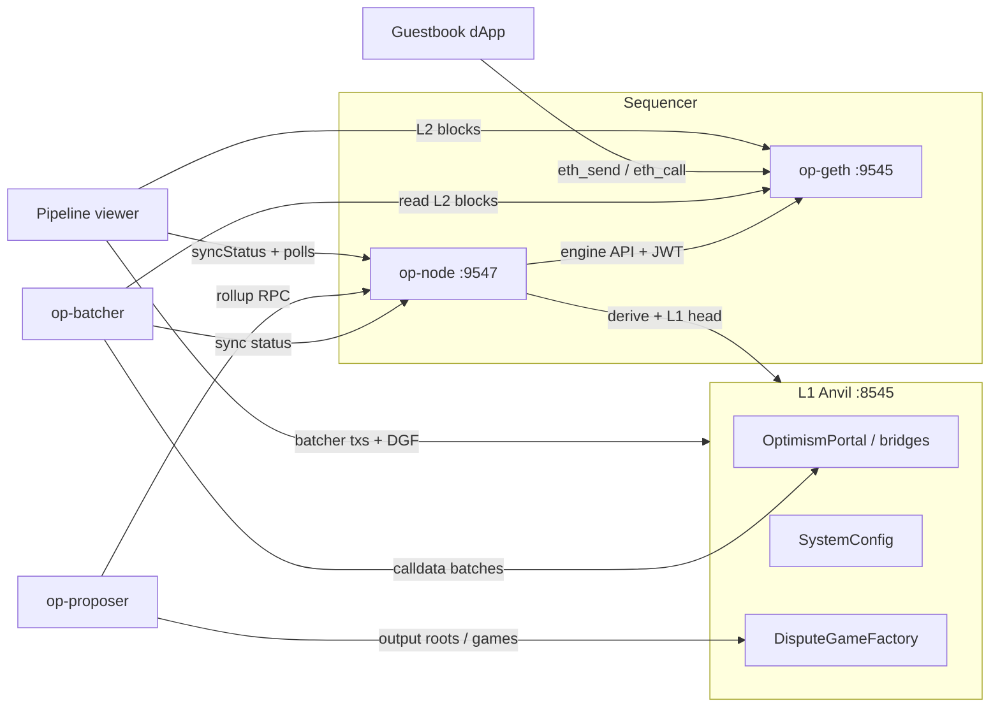

# ForteL2

A personal Ethereum Layer 2, built on the [OP Stack](https://docs.optimism.io/) to understand how rollups actually work — by running one, then rebuilding its components from scratch — with a tentative plan to eventually graduate the chain to Ethereum mainnet as a full-fledged L2.

The strategy is **run first, rebuild later**. The early phases stand up the real production OP Stack on a Mac mini against a local L1 devnet, so the full pipeline is observable end to end: L2 block production → batch submission to L1 → state root proposals. Later phases progressively replace individual components (batcher, proposer, derivation pipeline) with from-scratch reimplementations targeting the [OP Stack specs](https://github.com/ethereum-optimism/specs), migrate the L1 to Sepolia, add remote and friend-operated replica nodes, and explore fault proofs and decentralized sequencing.

**Phases 1–8 are learning phases**: no real funds, no external users, no uptime commitments. Mainnet (Phase 9) is a gated, tentative decision — it requires the learning phases to succeed and a geographically distributed set of friend-operated verifier nodes to exist first. The acceptance criteria throughout require explaining concepts in writing, not just keeping processes alive.

## Architecture

Base-style rollups don't have PoS validators. The roles here are:

| Component | Role | Implementation |
|---|---|---|
| **Sequencer** | Orders transactions, builds L2 blocks | op-node + op-geth (sequencer mode) |
| **Batcher** | Compresses L2 tx data, posts it to L1 | op-batcher → custom rebuild (Phase 4) |
| **Proposer** | Posts L2 state output roots to L1 | op-proposer → custom rebuild (Phase 5) |
| **Replica / verifier** | Derives the L2 independently from L1 data | stock op-node + EL (verifier mode); remote on Render, then friend-operated |
| **Pipeline viewer** | Loopback-only UI showing sequencer / batcher / proposer / mempool activity | DIY static UI polling RPC — ops dashboard, not a full block explorer |
| **Block viewer** | Latest L2 blocks → per-block detail (Blockchair-shaped) | Phase 6 — still loopback/static; Blockscout much later |

Everything runs as **native arm64 binaries** on a single Apple Silicon Mac mini — no Docker, no Kurtosis (see Design Decisions and `tasks/spike-notes.md`). Local L1 is Anvil; the demo dApp is a MetaMask-connected guestbook.

## Roadmap

| Phase | Scope | Status |
|---|---|---|
| **0** | Deployment-path spike: Kurtosis `optimism-package` vs. manual builds on Apple Silicon | ✅ Done — verdict: manual native builds |
| **1** | Full OP Stack devnet on the Mac mini: Anvil L1, op-deployer, sequencer, batcher, proposer, demo dApp | ✅ Done |
| **1b** | Bridging: L1→L2 deposits via the Standard Bridge; full L2→L1 withdrawals with a shortened challenge window; Phase 2 readiness gate | ✅ Done |
| **1c** | DIY pipeline viewer: live sequencer / batcher / proposer / tx activity panels on loopback | ✅ Done |
| **1d** | Viewer mempool signal + Sepolia funding and fresh-key gate | ✅ Done |
| **2a** | Sepolia scaffold: `.env.sepolia` tree, L2 chain **852**, public RPC, no on-chain spend | ✅ Done |
| **2b** | Disposable `op-deployer apply` on Sepolia + genesis under `deployments/sepolia/` | ✅ Done — 2026-07-22 deploy now **pinned through Phase 6** |
| **2c** | L2 against Sepolia L1 (short batcher/proposer run + deposit dry-run) | ✅ Done |
| **2d** | Dedicated L1 RPC via **QuickNode** (env swap; no redeploy) | ✅ Done |
| **3** | **Replica node on Render** — stock verifier, L1-derived sync ([fortel2-replica](https://github.com/StephenForte/fortel2-replica)) | ✅ Done |
| **3b** | **Friend-operated verifier nodes**: geographically distributed operators, onboarded on Sepolia first | Planned — runbook [`replica/FRIENDS.md`](replica/FRIENDS.md); recruiting is operator-owned |
| **4** | **Reimplement the batcher** from scratch; swap out op-batcher | ✅ Done — [`tasks/prd-phase-4-batcher.md`](tasks/prd-phase-4-batcher.md) + [`batcher/`](batcher/); `USE_CUSTOM_BATCHER=1` opt-in |
| **5** | **Reimplement the proposer** from scratch; swap out op-proposer | ✅ Done — [`tasks/prd-phase-5-proposer.md`](tasks/prd-phase-5-proposer.md) + [`proposer/`](proposer/); `USE_CUSTOM_PROPOSER=1` opt-in |
| **6** | **Derivation / minimal sequencer** + simple Blockchair-style **block viewer** (latest blocks → block detail); Blockscout stays much later | ✅ Done (2026-08-04) — [`tasks/prd-phase-6-derivation.md`](tasks/prd-phase-6-derivation.md) + [`derivation/`](derivation/) + [`blocks/`](blocks/) |
| **3a** | Native Mac mini Sepolia L1 (optional; was 2e) — after 4–6 unless RPC forces earlier | Deferred |
| **7** | **Fault proofs**: run op-challenger, exercise a dispute game against a deliberately bad proposal — begins with a **coordinated redeploy** (all new fault-game immutables chosen in one sitting) + network-wide reset | Planned — spec [`tasks/prd-phase-7-fault-proofs.md`](tasks/prd-phase-7-fault-proofs.md) (do not execute the wipe from this row) |
| **8** | **Decentralized sequencer** exploration: multiple candidates, leader election | Planned |
| **9** | **Mainnet (tentative)**: graduate to Ethereum mainnet as L1, production key management, real ETH economics — gated on earlier phases + committed distributed node network | Decision not locked — P7-0 leftovers expanded in [`tasks/prd-mainnet-pilot.md`](tasks/prd-mainnet-pilot.md) |

Canonical acceptance criteria: `tasks/prd-l2-learning-chain.md`.

## Design decisions

- **Native builds, no containers.** The Phase 0 spike attempted Kurtosis's `optimism-package`; OrbStack disrupted host networking and the enclave never stabilized, while op-node and op-geth built cleanly as native arm64 binaries. Verdict: manual builds from the optimism monorepo, orchestrated with shell scripts. No Docker on this workstation.
- **DIY viewers instead of Blockscout.** Hosted explorers need a non-loopback RPC; self-hosted Blockscout needs containers. Both stay out of scope for a long time. Phase 1c ships a purpose-built loopback **pipeline viewer** (sequencer→batcher→proposer + mempool). Phase 6 adds a simple Blockchair-style **block viewer** (newest-first blocks list + per-block detail) — still loopback/static, still not Etherscan/Blockscout.
- **Withdrawals in Phase 1b, not later.** The 7-day challenge window normally makes withdrawals a scope grenade, but a local devnet controls the finalization period — shortened, the full initiate→prove→finalize flow becomes a one-evening exercise. Cheap to learn locally, expensive to learn on Sepolia where the window can't be shortened.
- **Fault proofs deferred to Phase 7.** On a solo devnet with one trusted proposer there is no adversary; the dispute game is best learned after rebuilding the proposer (Phase 5), when output roots are understood from the inside. Phase 7 **begins with the next Sepolia redeploy**: the current fault-game immutables (`faultGameMaxClockDuration=10`, learning-short proof-maturity / finality delays) are too short to exercise a real dispute game, and immutables only change via redeploy. Choose **all** new immutables in one sitting — fault-game clocks, `proofMaturityDelaySeconds`, `disputeGameFinalityDelaySeconds` — sized for realistic games (minutes-to-hours, not seconds, not mainnet's multi-day values). A forgotten parameter means a second redeploy and a second network-wide wipe.
- **Sepolia deployment pinned through Phase 6 (decided 2026-07-22).** Phases 4–6 are client-side rebuilds (batcher, proposer, derivation) against **unchanged** L1 contracts — no redeploy is needed or permitted during them. Keeping the same deployment also accumulates months of real batch history on L1, which becomes the test data for the Phase 6 derivation rebuild. The next redeploy is the **Phase 7 entry gate**.
- **Sepolia doesn't inherit the Phase 1 chain.** Phase 2 is a fresh contract deployment and fresh genesis — the local chain gets replaced, not migrated. The runbook is structured so redeployment is cheap.
- **Key hygiene as a phase gate.** Phase 2 requires fresh keys generated outside the repo — never Foundry defaults, never keys pasted into agent chats — and a funded Sepolia balance floor before sustained batcher/proposer operation.

## Success metrics

Cold start to producing L2 blocks in under 30 minutes from the runbook alone. The full pipeline — L2 tx → batch on L1 → output root on L1 — demonstrable in one sitting with `cast`. The operator can explain, without notes, what each OP Stack component does and what breaks when it stops.

## Notes

Built and operated as a solo project (for now — Phase 3b changes that). Related work: [settlementos](https://github.com/StephenForte/settlementos) and its [independent explorer](https://github.com/StephenForte/settlementos-explorer), deployed to Base Sepolia and Polygon Amoy.

### SettlementOS money-rail track

SettlementOS is the payments application; this L2 is the intended home rail. **SOS may start integration now** on Sepolia ForteL2 (chain **852**) — do not wait for Phase 3b or 4–6.

| Doc | Purpose |
|---|---|
| [`deployments/rail-interface.json`](deployments/rail-interface.json) | Chain IDs, RPCs, bridge proxies, reset + replica policy |
| [`tasks/prd-money-rail.md`](tasks/prd-money-rail.md) | ForteL2 money-rail PRD (SOS gates + **Replica update checklist**) |
| [`tasks/coordination-settlementos.md`](tasks/coordination-settlementos.md) | Who owns what (no duplicate escrow/MMF) |
| SOS handoff | `settlementos/tasks/prd-fortel2-integration.md` |

**SOS onboarding (operator):**

0. **Availability + write path:** the Sepolia sequencer RPC is stopped nightly **23:45–03:00** local (`America/Los_Angeles`); SOS retry/backoff must assume that outage. There is no uptime commitment (personal L2 on a Mac mini). **Writes** on the mini: full operator RPC at `http://127.0.0.1:9545`, D1 allowlist filter at `http://127.0.0.1:9555` (see [Write RPC filter](#write-rpc-filter-t5-d1--ethnetweb3-allowlist)). US-012 is a **GO**; Cloudflare Access hostname `https://fortel2-write.ente.ltd` dials **:9555 only** (D-0034 / D-0035; see [Authenticated Cloudflare tunnel](#authenticated-cloudflare-tunnel-t5-step-3--d-0034) and [the go/no-go](#us-012-non-loopback-gono-go--sepolia-sequencer-write-path-2026-08-11)). Access is proven. The write URL is **not** in `rail-interface.json` (other clients lack Access headers).
1. Start the Sepolia stack: `FORTEL2_ENV=.env.sepolia ./scripts/start-all-sepolia.sh` (after Phase 2b deploy + fund check).
2. Fund the SOS deployer on L2: deposit L1→L2 with `FORTEL2_ENV=.env.sepolia ./scripts/deposit-eth-sepolia.sh` (credits `ADMIN_ADDRESS` on L2), then transfer to the SOS deployer — note the env file must be sourced in *this* shell (the `FORTEL2_ENV=…` prefix only reaches the script's subprocess): `( set -a; source .env.sepolia; set +a; cast send <SOS_DEPLOYER_ADDRESS> --value <amount> --rpc-url "$L2_RPC_URL" --private-key "$ADMIN_PRIVATE_KEY" )`.
3. Point SettlementOS **locally** at the Mac sequencer **`L2_RPC_URL`** from `.env.sepolia` (loopback `http://127.0.0.1:9545`). On **Render**, SettlementOS uses `FORTEL2_SEPOLIA_RPC_URL=https://fortel2-write.ente.ltd` plus Access headers (D-0035). Deploy SOS contracts on chain **852**.
4. **Writes** (tx submit, contract deploy) → D1 filter / Access hostname for remote SOS; operator tooling stays on loopback `:9545`. **Reads:** public replica `https://fortel2-replica-rpc.onrender.com` (~3 min L1 lag); public sequencer tip `https://fortel2-sequencer-rpc.onrender.com` (tip-follow; down 23:45–03:00). SOS on Render still uses private `http://fortel2-replica:10000` (D-0032). The Access write hostname stays **unpublished** in `rail-interface.json` (D-0035).

**Replica reminder:** Phase 3 is done. Republish genesis/rollup to [fortel2-replica](https://github.com/StephenForte/fortel2-replica) only on a Sepolia **redeploy** (next expected: Phase 7). Do not pack/publish “just in case” while the deployment is pinned through Phase 6. Phase 7 order: [`tasks/prd-phase-7-fault-proofs.md`](tasks/prd-phase-7-fault-proofs.md) § Operator sequence. See also `replica/README.md` and the Network reset procedure under Phase 3.

---

# Operator runbook (Phase 1)

Phase 1 is a local OP Stack learning rollup on Apple Silicon. **Native binaries only** — no Docker, OrbStack, or Kurtosis on this host.

## Locked decisions (Phase 1)

| Choice | Value |
|---|---|
| L1 | Anvil (Foundry), chain ID **900** |
| L2 | op-geth + op-node sequencer, chain ID **901** |
| Deploy | native `op-deployer` → live Anvil |
| DA | **calldata** batches (`--data-availability-type=calldata`) — Anvil has no beacon/blobs |
| EL | **op-geth** (`--l2.enginekind=geth`) — verified arm64 in Phase 0 |
| L1 / L2 block time | **both 2s** (`L1_BLOCK_TIME` must be ≥ `L2_BLOCK_TIME`) |
| Explorer | `cast` / RPC + Phase 1c **pipeline viewer**; Phase 6 **block viewer** (done); Blockscout / hosted explorers deferred much later |

## Toolchain versions

| Tool | Version | Notes |
|---|---|---|
| Go | 1.26.5 (`darwin/arm64`) | Homebrew |
| just | 1.56.0 | Homebrew |
| yq | 4.53.3 | Homebrew |
| jq | 1.8.2 | Homebrew |
| Foundry (`forge`/`cast`/`anvil`) | 1.7.1 | `foundryup` |
| optimism monorepo | `op-node/v1.19.2` (`da197e45…`) | `~/src/fortel2/optimism` |
| op-geth | `v1.101702.2` | `~/src/fortel2/op-geth` |
| op-deployer | `0.7.1` (release binary) | `~/src/fortel2/bin/op-deployer` |

Source trees and **runtime data** live under `~/src/fortel2/` (outside Dropbox). This repo symlinks binaries via `./bin/`. `DATA_DIR` defaults to `~/src/fortel2/data` so Anvil state / op-geth datadir are not Dropbox-synced.

**No Docker / OrbStack / Kurtosis** for Phase 1 on this workstation.

## Topology


```mermaid
flowchart LR
  subgraph L1["L1 Anvil :8545"]
    Portal[OptimismPortal / bridges]
    SysCfg[SystemConfig]
    DGF[DisputeGameFactory]
  end
  subgraph Seq["Sequencer"]
    Geth["op-geth :9545"]
    Node["op-node :9547"]
    Node -->|engine API + JWT| Geth
  end
  Batcher[op-batcher] -->|calldata batches| Portal
  Proposer[op-proposer] -->|output roots / games| DGF
  Node -->|derive + L1 head| L1
  Batcher -->|read L2 blocks| Geth
  Batcher -->|sync status| Node
  Proposer -->|rollup RPC| Node
  Dapp[Guestbook dApp] -->|eth_send / eth_call| Geth
  Viewer[Pipeline viewer] -->|syncStatus + polls| Node
  Viewer -->|batcher txs + DGF| L1
  Viewer -->|L2 blocks| Geth
```

## Roles (who does what)

- **op-geth** — L2 execution client (EVM, state, tx pool). Engine API on `:9551`.
- **op-node** — consensus / derivation / sequencing. With `--sequencer.enabled` it builds L2 blocks and drives op-geth. `--l2.enginekind=geth`.
- **op-batcher** — compresses L2 tx data into frames and posts them to L1 (here: calldata to the batch inbox).
- **op-proposer** — posts L2 output roots to L1 via DisputeGameFactory so withdrawals can later be proven (Phase 1b).

## Quick start

```bash
cp .env.example .env          # throwaway Anvil keys — never real funds
chmod +x scripts/*.sh
./scripts/start-all.sh        # L1 → deploy (first time) → sequencer → batcher → proposer
./scripts/status.sh
./scripts/smoke-transfer.sh   # L2 ETH transfer between genesis accounts
./scripts/deposit-eth.sh      # Phase 1b: L1→L2 ETH via Standard Bridge (ADMIN)
./scripts/withdraw-initiate.sh && ./scripts/withdraw-prove.sh && ./scripts/withdraw-finalize.sh
./scripts/deploy-guestbook.sh
./scripts/serve-dapp.sh       # http://127.0.0.1:8080
./scripts/serve-viewer.sh     # http://127.0.0.1:8081 pipeline viewer (Phase 1c)
./scripts/demo-checklist.sh   # operator demo: auto smokes + human checklist
FORTEL2_ENV=.env.sepolia ./scripts/demo-checklist.sh   # Sepolia twin (or --sepolia)
./scripts/demo-live.sh --local   # health + talk track + guestbook/viewer URLs
FORTEL2_ENV=.env.sepolia ./scripts/demo-live.sh --sepolia
python3 scripts/pipeline-snapshot.py -o /tmp/fortel2-health.json   # one-shot pipeline health JSON
```

### Tests / merge guardrails

```bash
export PATH="$HOME/.foundry/bin:$PATH"
cd contracts && forge test          # Guestbook unit + fuzz tests
./scripts/test-helpers.sh          # address / loopback / block-time / key-tripwire / viewer config
node --test viewer/lib.test.js dapp/lib.test.js  # viewer + guestbook UTF-8 helpers
(cd scripts/bridge && npm ci && node --test lib.test.js)  # withdrawal bridge helpers
```

GitHub Actions runs the same suite on every PR (`.github/workflows/ci.yml`). Startup scripts hard-fail if `L1_BLOCK_TIME < L2_BLOCK_TIME` or operator L2 RPCs leave loopback. Broadcast scripts refuse Foundry default keys when `L2_CHAIN_ID != 901`. Public L2 JSON-RPC is only the two named read gateways in `rail-interface.json` (D-0047).

Agent workflow notes live in `AGENTS.md`. `scripts/lib.sh` process helpers (`start_bg` / `stop_bg`) are privileged — see `.github/CODEOWNERS`. `serve_static_loopback` is not privileged process control.
Stop / reset:

```bash
./scripts/stop-all.sh         # keep datadir + contracts
./scripts/reset.sh            # wipe everything → next start redeploys
```

Cold start from nothing: install toolchain (below) → `cp .env.example .env` → `./scripts/start-all.sh`.

## Toolchain install (once)

```bash
brew install go just yq jq
curl -L https://foundry.paradigm.xyz | bash && foundryup

mkdir -p ~/src/fortel2 && cd ~/src/fortel2
git clone --depth 1 --branch op-node/v1.19.2 https://github.com/ethereum-optimism/optimism.git
git clone --depth 1 --branch v1.101702.2 https://github.com/ethereum-optimism/op-geth.git

cd optimism
git submodule update --init --recursive
just build-superchain-go
just op-node && just op-batcher && just op-proposer

cd ../op-geth && make geth

# op-deployer: release binary (monorepo forge build wants forge 1.2.3)
curl -L -o /tmp/op-deployer.tgz \
  https://github.com/ethereum-optimism/optimism/releases/download/op-deployer/v0.7.1/op-deployer-0.7.1-darwin-arm64.tar.gz
tar -xzf /tmp/op-deployer.tgz -C /tmp
mkdir -p ~/src/fortel2/bin
cp /tmp/op-deployer-0.7.1-darwin-arm64/op-deployer ~/src/fortel2/bin/
ln -sfn ~/src/fortel2/optimism/op-node/bin/op-node ~/src/fortel2/bin/op-node
ln -sfn ~/src/fortel2/optimism/op-batcher/bin/op-batcher ~/src/fortel2/bin/op-batcher
ln -sfn ~/src/fortel2/optimism/op-proposer/bin/op-proposer ~/src/fortel2/bin/op-proposer
ln -sfn ~/src/fortel2/op-geth/build/bin/geth ~/src/fortel2/bin/op-geth
```

## Endpoints

| Service | URL |
|---|---|
| L1 RPC | `http://127.0.0.1:8545` (chain 900) |
| L2 RPC | `http://127.0.0.1:9545` (chain 901) |
| op-node RPC | `http://127.0.0.1:9547` |
| dApp | `http://127.0.0.1:8080` |
| Pipeline viewer | `http://127.0.0.1:8081` |

Prefunded L1/L2 accounts use the Foundry test mnemonic (`test test … junk`). Keys are in `.env.example`.

**L2 funding quirk:** `fundDevAccounts = true` funds many Anvil-style accounts on L2, but **not** account 0 (`ADMIN_ADDRESS` / `0xf39F…`). Use `DEMO_A` / `DEMO_B` (or batcher/proposer/sequencer keys) for L2 txs. Account 0 remains the L1 deployer and stays richly funded on L1 — which makes it the natural sender for Phase 1b deposits.

## Deposits L1 → L2 (US-010)

```bash
./scripts/deposit-eth.sh
# optional: DEPOSIT_AMOUNT=0.25ether ./scripts/deposit-eth.sh
```

This calls `L1StandardBridge.bridgeETH` from **ADMIN** (rich on L1, zero on L2 at genesis). op-node derives a **deposit transaction** onto L2; the script prints the L1 tx hash and waits until ADMIN’s L2 balance rises.

**How deposits differ from normal L2 txs:** a MetaMask / `smoke-transfer.sh` tx enters the sequencer mempool and can be reordered or censored by the sequencer. A deposit is an L1 transaction to the portal/bridge; the derivation pipeline **must** include it in an L2 block. The sequencer cannot drop it without stalling derivation. That is why deposits are the censorship-resistant ingress path even on a centralized sequencer.

## Withdrawals L2 → L1 (US-011)

Full path (three txs): **initiate on L2 → prove on L1 → finalize on L1**.

```bash
# After a deposit (ADMIN needs L2 ETH), with proposer running:
./scripts/withdraw-initiate.sh    # L2ToL1MessagePasser.initiateWithdrawal
./scripts/withdraw-prove.sh       # wait for dispute game + OptimismPortal.proveWithdrawalTransaction
./scripts/withdraw-finalize.sh    # resolve game if needed, wait/warp delays, finalizeWithdrawalTransaction
./scripts/verify-portal-delays.sh # inspect portal immutables
```

Artifacts land in `$DATA_DIR/bridge/last-withdrawal.json` (L2 + prove + finalize hashes). Prove/finalize use a small Node helper under [`scripts/bridge/`](scripts/bridge/) (`viem` op-stack actions; `npm ci` on first run).

### Shortened challenge window (local only)

`scripts/02-deploy-contracts.sh` writes op-deployer `[globalDeployOverrides]`:

| Intent / env knob | Default (local) | Mainnet-scale |
|---|---|---|
| `proofMaturityDelaySeconds` (`PROOF_MATURITY_DELAY_SECONDS`) | **12** | 604800 (7d) |
| `disputeGameFinalityDelaySeconds` (`DISPUTE_GAME_FINALITY_DELAY_SECONDS`) | **6** | 302400 (3.5d) |
| `faultGameMaxClockDuration` | **10** | hours+ |
| `faultGameWithdrawalDelay` | **1** | longer |

These are portal/game **immutables** — changing them requires `./scripts/reset.sh` then `./scripts/start-all.sh` (redeploy). If your `op-deployer` build ignores the overrides ([optimism#14869](https://github.com/ethereum-optimism/optimism/issues/14869)), `verify-portal-delays.sh` warns and `withdraw-finalize.sh` **Anvil time-warps** (`evm_increaseTime`) using the portal’s on-chain delays and the dispute game’s on-chain `maxClockDuration` (not just `.env` defaults) so the learning path still completes in one sitting.

**Why mainnet uses ~7 days:** the prove→finalize delay is the window for an honest party to challenge a bad output root before funds leave L1. On this solo learning chain the proposer key is trusted (no `op-challenger`); shortening the window is for operator ergonomics only. Fault proofs (Phase 7) are what replace “trust the proposer” with “anyone can dispute.”

## `rollup.json` in plain words

After deploy, `deployments/.deployer/rollup.json` tells op-node how this L2 relates to L1:

- **`l1_chain_id` / `l2_chain_id`** — which L1 we settle on (900) and our L2 identity (901).
- **`block_time`** — seconds between L2 blocks (2).
- **`batch_inbox_address`** — L1 address the batcher sends compressed tx data to.
- **`deposit_contract_address`** — OptimismPortal on L1 (deposits; Phase 1b).
- **`genesis`** — L2 genesis hash/number/time and system config snapshot (batcher address, gas limits, etc.).

## What is inside a batch? (US-005)

The batcher watches L2 blocks, packs their transactions into **channels** of compressed **frames**, and submits those frames to L1 (here as ordinary calldata txs to the batch inbox). Anyone with the L1 history can re-run the **derivation pipeline** (what op-node does in verifier mode) and rebuild the same L2 chain. That is what “the L2 is derivable from L1” means: L1 data availability, not L2 peer sync, is the source of truth for reconstructing state.

### Observed: stop batcher 5 minutes, then restart (US-005)

Ran on this chain (2026-07-18): kill `op-batcher` only, leave sequencer + Anvil running, sample every 30s, then `./scripts/05-start-batcher.sh`.

| Phase | What happened |
|---|---|
| During stop (~5 min) | **Batcher L1 nonce frozen** at 49 (no new batch txs). **Unsafe L2 kept advancing** (~308 → 459). **Safe L2 stuck** at 296 — derivation cannot promote new unsafe blocks without fresh L1 data. |
| On restart | Batcher immediately closed a **catch-up channel** covering the backlog (~164 L2 blocks, ~12KB compressed calldata, gas ~498k vs normal ~41k). Nonce resumed climbing (49 → 57 in ~90s). **Safe L2 climbed** toward the tip (296 → 496) as frames landed and op-node derived them. |

Takeaway: stopping the batcher does **not** stop the sequencer; it only pauses L1 data availability. Restart recovers by posting a larger backlog batch, then resumes steady-state cadence.

### Phase 4 — custom batcher (opt-in)

Learning rebuild under [`batcher/`](batcher/). Stock `op-batcher` stays the default.

```bash
# Local demo
USE_CUSTOM_BATCHER=1 ./scripts/05-start-batcher.sh
# Kill switch
kill "$(cat "$DATA_DIR/pids/op-batcher.pid")" && rm -f "$DATA_DIR/pids/op-batcher.pid"
./scripts/05-start-batcher.sh

# Optional Sepolia window (~15 min max) — requires explicit confirm
FORTEL2_ENV=.env.sepolia USE_CUSTOM_BATCHER=1 CONFIRM_CUSTOM_BATCHER_SEPOLIA=1 \
  ./scripts/05-start-batcher-sepolia.sh
```

Wire-format notes and safe/unsafe lag: [`tasks/spike-phase-4-batcher.md`](tasks/spike-phase-4-batcher.md) (US-045). Operator switch details: [`batcher/README.md`](batcher/README.md).

### Phase 5 — custom proposer (opt-in)

Learning rebuild under [`proposer/`](proposer/). Stock `op-proposer` stays the default. Posts to **DisputeGameFactory** (`PROPOSER_GAME_TYPE=1`); L2OutputOracle is unused on this deploy.

```bash
# Local demo
USE_CUSTOM_PROPOSER=1 ./scripts/06-start-proposer.sh
# Kill switch
kill "$(cat "$DATA_DIR/pids/op-proposer.pid")" && rm -f "$DATA_DIR/pids/op-proposer.pid"
./scripts/06-start-proposer.sh

# Optional Sepolia window (~15 min max) — requires explicit confirm
FORTEL2_ENV=.env.sepolia USE_CUSTOM_PROPOSER=1 CONFIRM_CUSTOM_PROPOSER_SEPOLIA=1 \
  ./scripts/06-start-proposer-sepolia.sh
```

Output-root / trust-model notes: [`tasks/spike-phase-5-proposer.md`](tasks/spike-phase-5-proposer.md) (US-055). Operator switch details: [`proposer/README.md`](proposer/README.md).

### Tracked dependency advisories (Go modules + frontend vendors)

Last refresh: **2026-08-04** (Wave 6 / H2). Reproduce: `govulncheck ./…` in `batcher/`, `proposer/`, `derivation/`; `(cd scripts/bridge && npm ci && npm audit)`; compare `sha256sum dapp/vendor/ethers-*.min.js viewer/vendor/ethers-*.min.js blocks/vendor/ethers-*.min.js`.

| Advisory | Module | Status | Notes |
|---|---|---|---|
| [GO-2026-5932](https://pkg.go.dev/vuln/GO-2026-5932) | `golang.org/x/crypto` (via `go-ethereum`) | **Tracked — no upstream module fix** | Applies to the frozen `x/crypto/openpgp` subtree only. **None** of `batcher/`, `proposer/`, or `derivation/` import or call `openpgp` (repo grep + `govulncheck -show verbose` on `derivation/` — symbol scan clean; module-level note only). Indirect pin is `golang.org/x/crypto v0.54.0` for other packages (e.g. `ripemd160`). Re-check on every `go-ethereum` / `x/crypto` bump; never import `openpgp` here — if OpenPGP is ever required, use [`ProtonMail/go-crypto`](https://github.com/ProtonMail/go-crypto). Roadmap tracking: `tasks/prd-l2-learning-chain.md`. |

**H2 bumps (2026-08-04):**

| Area | Dependency | From → To | Advisory / reason |
|---|---|---|---|
| `batcher/` | `github.com/klauspost/compress` | v1.17.11 → v1.18.7 | [GO-2026-5841](https://pkg.go.dev/vuln/GO-2026-5841) — aligned with `derivation/` |
| `batcher/` | `github.com/pion/dtls/v3` | v3.1.2 → v3.1.4 | CVE-2026-54908 — aligned with `derivation/` |
| `proposer/` | `github.com/klauspost/compress` | v1.17.11 → v1.18.7 | GO-2026-5841 — aligned with `derivation/` |
| `proposer/` | `github.com/pion/dtls/v3` | v3.1.2 → v3.1.4 | CVE-2026-54908 — aligned with `derivation/` |
| `derivation/` | *(no change)* | compress v1.18.7, dtls v3.1.4 already current | — |
| `scripts/bridge` | `viem` / `ws` | unchanged | `npm audit`: 0 vulnerabilities |
| vendored ethers | npm `ethers` | 6.13.5 → **6.13.7** (latest 6.13.x patch; 6.17.0 is latest 6.x minor — not taken) | three copies byte-identical; see `dapp/vendor/README.md` |
| `contracts/` | `forge-std` | v1.16.2 (pinned) | matches upstream latest tag; no advisory — report only |

Reproduce:

```bash
# baseline
cast nonce "$BATCHER_ADDRESS" --rpc-url "$L1_RPC_URL"
cast rpc optimism_syncStatus --rpc-url "$L2_NODE_RPC_URL" | jq '{unsafe:.unsafe_l2.number, safe:.safe_l2.number}'

# stop only the batcher
kill "$(cat "$DATA_DIR/pids/op-batcher.pid")" && rm -f "$DATA_DIR/pids/op-batcher.pid"
# wait ~5 minutes; watch nonce stay flat while unsafe L2 rises and safe L2 stalls

# restart
./scripts/05-start-batcher.sh
# watch nonce rise again and safe head catch up; log: "Publishing transaction" / "Channel closed"
```

Inspect batcher activity anytime:

```bash
cast nonce 0x70997970C51812dc3A010C7d01b50e0d17dc79C8 --rpc-url http://127.0.0.1:8545
# rising nonce ⇒ batch txs submitted
```

## Proposer trust model (US-006)

On this solo learning chain the proposer key is trusted: whatever output root it posts to the DisputeGameFactory is what L1 will treat as the L2 tip for withdrawals. There is no independent challenger watching for lies (that is Phase 7 / fault proofs). Fault proofs would let anyone dispute a bad root inside a challenge window instead of trusting a single proposer key.

Read games / factory (addresses in `deployments/deployments.json`):

```bash
FACTORY=$(jq -r .DisputeGameFactoryProxy deployments/deployments.json)
cast call "$FACTORY" "gameCount()(uint256)" --rpc-url http://127.0.0.1:8545
```

On Anvil, L2 finality never advances the way it does on a real L1, so the proposer is started with `--allow-non-finalized` and proposes against the **safe** head (after batches land) rather than waiting for finalized.
## Chain inspection without Blockscout (US-007)

```bash
# Tip
cast block-number --rpc-url http://127.0.0.1:9545

# Recent block
cast block latest --rpc-url http://127.0.0.1:9545

# Tx by hash
cast tx <TX_HASH> --rpc-url http://127.0.0.1:9545
cast receipt <TX_HASH> --rpc-url http://127.0.0.1:9545

# Contract read
cast call <ADDR> "count()(uint256)" --rpc-url http://127.0.0.1:9545

# Balance
cast balance 0x9965507D1a55bcC2695C58ba16FB37d819B0A4dc --rpc-url http://127.0.0.1:9545
```

Blockscout / other containerized explorers, and hosted SaaS explorers (e.g. Ethernal), are **explicitly deferred** on this host to a **much later** stage (after Phase 8 learning goals, or when a non-loopback RPC is deliberately allowed). Phase 1c’s **pipeline viewer** is the ops dashboard; Phase 6 adds a simple Blockchair-style **block viewer** (latest blocks → block detail) — still not a full explorer.

## Pipeline viewer (Phase 1c / 1d / Sepolia)

Ops dashboard for the sequencer → batcher → proposer path. Client-side polls only (no indexer).

```bash
# Phase 1 (local Anvil L1 + L2 901)
./scripts/serve-viewer.sh   # regenerates viewer/config.js + .csp-header, then http://127.0.0.1:8081/
./scripts/demo-live.sh --local   # health checks + talk track + open guestbook/viewer

# Phase 2 Sepolia (remote L1 + local L2 852) — stack must already be up via start-all-sepolia.sh
FORTEL2_ENV=.env.sepolia ./scripts/serve-viewer.sh
FORTEL2_ENV=.env.sepolia ./scripts/demo-live.sh --sepolia
FORTEL2_ENV=.env.sepolia ./scripts/demo-checklist.sh   # or --sepolia
python3 scripts/pipeline-snapshot.py -o /tmp/fortel2-health.json  # one-shot JSON mini-viewer
```

Stopping the viewer (Ctrl-C) does **not** stop the chain. Config is built from the active env + `deployments.json` + `rollup.json`. `viewer/config.js` and `viewer/.csp-header` are **gitignored** (Sepolia `config.js` embeds your L1 RPC URL). Use `./scripts/serve-viewer.sh` so the CSP header allows the L1 origin without committing it into `index.html`. Typography (Inter/JetBrains Mono, per `DESIGN.md`) is **vendored** under `viewer/fonts/` — no Google Fonts CDN at runtime.

| Panel | RPCs | What it shows |
|---|---|---|
| **Sequencer** | op-node `optimism_syncStatus`, L2 blocks | Unsafe / safe / finalized heads, lag, recent block interval |
| **Batcher** | L1 recent blocks | Posts from `BATCHER_ADDRESS` → batch inbox (last hash, age, cadence) |
| **Proposer** | L1 DisputeGameFactory | `gameCount`, latest game proxy / age / type |
| **Aggregate** | L2 recent blocks + `txpool_status` | Empty vs non-empty, tx/min, **mempool** pending/queued |

**Mempool vs heads:** Sequencer unsafe/safe is what already landed (or is safe via L1). Aggregate mempool is txs still waiting in op-geth — useful right after MetaMask submit, before the next L2 block. Not a full mempool dump or tx search.

Refresh cadence defaults to **5s** locally and **15s** on Sepolia (override with `VIEWER_REFRESH_MS`). Sepolia mode also uses a 12-block incremental L1 scan so Batcher/Proposer do not re-fetch dozens of full blocks every tick. Panel RPC failures surface as plain status text — panels do not silently go stale.

Guestbook (`:8080`) is the demo write path; the pipeline viewer (`:8081`) is the ops/learning surface. Neither is an address/tx search explorer — see the **block viewer** (`:8082`) below for latest-blocks browsing. Blockscout stays much later.

## Block viewer (Phase 6)

Blockchair-shaped **latest blocks → block detail** UI for the L2. Client-side L2 RPC polls only (no indexer, no search, no address pages). Distinct from the Phase 1c **pipeline viewer** above — that one tracks sequencer/batcher/proposer ops; this one browses block headers and tx rows.

```bash
# Phase 1 (local Anvil L1 + L2 901) — stack must be running
./scripts/serve-blocks.sh   # regenerates blocks/config.js + .csp-header, then http://127.0.0.1:8082/

# Phase 2 Sepolia (remote L1 + local L2 852)
FORTEL2_ENV=.env.sepolia ./scripts/serve-blocks.sh
```

| View | What it shows |
|---|---|
| **Latest blocks** | Recent L2 blocks newest-first: height, short hash, timestamp, tx count; **Load more** for older blocks |
| **Block detail** | `#/block/<number>` or `#/block/<hash>` — header fields + tx rows (hash, from/to, value, type) |

`blocks/config.js` and `blocks/.csp-header` are **gitignored** (regenerated by `gen-blocks-config.sh`). RPC failures surface as plain status text — views do not silently go stale. All chain-derived strings render via `textContent`. Fonts are vendored under `blocks/fonts/` (self-contained; no CDN).

**Not an explorer:** no search, no address/token/NFT pages, no contract verification, no Blockscout. Works against L2 chain **901** (local) and **852** (Sepolia) via the same `FORTEL2_ENV` / generated-config pattern as the pipeline viewer.

## Derivation verifier (Phase 6 / US-061)

Side-by-side **derivation verifier** that reads L1 batch data, derives a bounded L2 window, and checks block hashes against the reference stack. Spike notes: `tasks/spike-phase-6-derivation.md`. Full spec: `tasks/prd-phase-6-derivation.md`. Module README: `derivation/README.md`.

```bash
# Reference stack must be running (local 901 default)
./scripts/derivation-check.sh

# Optional overrides
./scripts/derivation-check.sh --start-l2 1 --end-l2 20
./scripts/derivation-check.sh --channel-tx 0x64fa2834…   # single L1 batcher tx

# Mid-chain window (blocks 60–80) — requires anchor datadir copy (R2)
./scripts/stop-all.sh
./scripts/derivation-check.sh --make-anchor          # copy while stack stopped
./scripts/start-all.sh
./scripts/derivation-check.sh --start-l2 60 --end-l2 80

# Sepolia 852 — 50 blocks ending at reference safe_l2 (operator-run; needs anchor)
FORTEL2_ENV=.env.sepolia ./scripts/stop-all-sepolia.sh
FORTEL2_ENV=.env.sepolia ./scripts/derivation-check.sh --sepolia --make-anchor
FORTEL2_ENV=.env.sepolia ./scripts/start-all-sepolia.sh
FORTEL2_ENV=.env.sepolia ./scripts/derivation-check.sh --sepolia
```

### Window anchoring (R2 / mid-chain windows)

Sealing block **N** needs EL state at **N−1**. Genesis replay (blocks 1–20) initializes a fresh sealing EL from `genesis.json`. Mid-chain windows copy the reference datadir **while the stack is stopped**, start the sealing EL from that copy, roll it back with `debug_setHead` to block `start−1`, then seal forward. The copy step refuses to run if the reference RPC responds or `geth/LOCK` is present — a live copy is corrupt.

| Path | Role |
|---|---|
| `$DATA_DIR/l2/op-geth` | Reference EL (read-only at verify time) |
| `$DATA_DIR/l2/derivation-anchor-op-geth` | Stopped-stack copy for mid-chain anchoring (gitignored) |
| `$DATA_DIR/l2/derivation-op-geth` | Fresh genesis sealing EL (blocks 1–20 only) |

Batch numbering uses L2 timestamps: `(batch.timestamp − genesis.l2_time) / block_time`. L1 inbox scan bound derives from the anchor block's L1 origin minus `DERIVATION_L1_LOOKBACK` (default 300). Unbounded genesis L1 scans are refused when L1 tip exceeds ~1M blocks unless `--scan-from-genesis` is passed.

| Outcome | What you see |
|---|---|
| **PASS** | Per-block `derived=… expected=… OK` for every block in the window; `derivation-check: PASS`; exit 0 |
| **FAIL** | First mismatch logs `derived` vs `expected` hash; exit 1 |

The runbook starts a **separate** loopback `op-geth` for Engine API block sealing (`$DATA_DIR/l2/derivation-op-geth` for genesis replay, or `$DATA_DIR/l2/derivation-anchor-op-geth` for mid-chain windows; ports `:19645`/`:19651`). The live reference `op-geth` / `op-node` stay **read-only** — never send `engine_*` or `debug_setHead` to them (only to the copy). **Kill switch:** simply don't run `derivation-check.sh`; stock derivation is unchanged.

### Sequencer stub (US-062)

Minimal **block-building** learning stub (`derivation/cmd/sequencer-stub`) that seals ≥10 consecutive empty L2 blocks on a **second** isolated `op-geth` via the Engine API (`forkchoiceUpdatedV3` → `getPayloadV4`/`V3` → `newPayloadV4`/`V3`). Equivalent to driving the EL as `--l2.enginekind=geth`. Empty user-tx sets are intentional (tx-pool parity is out of scope). Follow-validation re-runs US-061 `BuildPayloadAttributes` and checks L1-info deposit bytes + parent links (D-T6-2).

```bash
# Reference stack should be up (L1 RPC + rollup.json); stub never touches reference Engine API
./scripts/sequencer-stub-demo.sh              # default --blocks 10
./scripts/sequencer-stub-demo.sh --blocks 12
```

| Isolation | Value |
|---|---|
| Datadir | `$DATA_DIR/l2/sequencer-stub-op-geth` |
| HTTP / auth / P2P | `:19745` / `:19751` / `:30324` (distinct from derivation-check) |
| JWT | `$DATA_DIR/jwt/sequencer-stub-jwt.txt` |

**Kill switch:** stop the demo (EXIT trap kills the stub EL) and `rm -rf "$DATA_DIR/l2/sequencer-stub-op-geth"`. The reference sequencer is **never displaced**, so “revert to stock op-node” is a no-op by construction. The demo prints a before/after reference-tip proof (historical block hash unchanged). Default L1 origin is `rollup.json` `genesis.l1` (not L1 tip); follow-validation also checks the sequencing-window timestamp invariant (R3).

## Phase 2 funding gate (Phase 1d / US-016)

Do **not** start Sepolia cutover until keys and balances are ready. **Base Sepolia ≠ Ethereum Sepolia** — L2 testnet balances cannot pay L1 Sepolia deploy or batcher gas.

| Floor | Meaning |
|---|---|
| **≥ ~0.5 ETH** Sepolia | Enough to attempt a disposable L1 contract deploy |
| **~1.0 ETH** Sepolia | Recommended before running batcher + proposer for any sustained period |

**Status:** Harvest wallet `0x5128889F20Ec13e0Be38b2BeBC568594159B652d` holds **~1.2 ETH** on Ethereum Sepolia (US-016 floor met). It is **harvest-only** — generate fresh role keys offline and fund them from this address in Phase **2b**.

**Keys (never Foundry defaults, never in this repo):**

```bash
# Outside the ForteL2 tree — private key goes in a password manager only
cast wallet new   # repeat for admin, batcher, proposer, sequencer, challenger
```

Fund **Ethereum Sepolia** (chain **11155111**) on the harvest wallet, then transfer to the Phase 2 deployer/batcher/proposer addresses when cutover starts. Never paste private keys into agent chats or commit them.

**Faucets (Ethereum Sepolia only — amounts and gates change):**

| Faucet | Notes |
|---|---|
| [Alchemy](https://www.alchemy.com/faucets/ethereum-sepolia) | Often ~0.5/day; free account; may require ~0.001 mainnet ETH |
| [Google Cloud Web3](https://cloud.google.com/application/web3/faucet) | Google login; good second source |
| [QuickNode](https://faucet.quicknode.com/ethereum/sepolia) | Backup; Infura’s UI may redirect here |
| Sepolia PoW faucet | Browser mining; slower; useful if mainnet-ETH gates block you |

Operator tip: keep harvesting toward **~1.0 ETH** before Phase 2; **~0.5 ETH** is only enough to attempt a disposable deploy.

## Phase 2b — Disposable Sepolia deploy (US-023)

**Prerequisite:** Phase 2a `.env.sepolia` filled offline. Fund **ADMIN** from harvest before apply (≥ ~0.70 ETH). BATCHER/PROPOSER (≥ ~0.15 each) can wait until Phase 2c.

```bash
# Balances + cast send examples (no broadcast/keys). Exit 1 if BATCHER/PROPOSER show NEED
# (ADMIN/HARVEST floors are advisory; deploy script gates ADMIN itself).
FORTEL2_ENV=.env.sepolia ./scripts/sepolia-fund-check.sh

# After ADMIN shows OK — spends Sepolia ETH; writes deployments/sepolia/ only
FORTEL2_ENV=.env.sepolia ./scripts/02-deploy-contracts-sepolia.sh
```

| Artifact | Path |
|---|---|
| op-deployer workdir | `deployments/sepolia/.deployer/` (gitignored) |
| L1 proxies | `deployments/sepolia/deployments.json` |
| Spend note | `deployments/sepolia/deploy-spend.txt` |

Intent uses `fundDevAccounts = false`, L2 chain **852**, learning-short portal delays (`faultGameClockExtension=5`, `faultGameMaxClockDuration=10`). The 2026-07-22 apply left `preimageOracleChallengePeriod` at op-deployer’s **86400** (not written into intent), so those clocks cannot `create()` a game — Phase 7 chooses all six knobs together and `02-deploy-contracts-sepolia.sh` now writes + validates the sixth. Resume keeps `state.json` but always rewrites `intent.toml` from current `.env.sepolia` (roles / fault-game delays) before apply. Phase 1 Anvil `deployments/` tree is never written. 2b was **designed** disposable (`FORCE_SEPOLIA_REDEPLOY=1` wipes then re-applies) — but the 2026-07-22 apply is now **pinned through Phase 6**. Do not redeploy: Phases 4–6 rebuild clients against these unchanged contracts, and the accumulating L1 batch history is Phase 6 derivation test data. Next redeploy = **Phase 7 entry gate** (new fault-game immutables; see Network reset procedure).

**Live Sepolia proxies (Phase 2b apply, 2026-07-22 cutover):** see `deployments/sepolia/deployments.json`. Portal `0xb4679b1c…08c624`, bridge `0x7ec222d9…85089f8`, DisputeGameFactory `0xba1fda6b…e49eed`. Prior Sepolia deploy is abandoned (that one was disposable). **This deployment is pinned through Phase 6** — redeployment is deferred to the Phase 7 gate.

## Phase 2c — Sepolia-backed L2 dry-run (US-024)

Runs the OP Stack L2 against **Ethereum Sepolia** L1. No Anvil. Runtime data lives in `DATA_DIR` from `.env.sepolia` (e.g. `~/src/fortel2/data-sepolia`) so Phase 1 `data/` is never touched. **Stop Phase 1 first** — default L2 ports are shared.

```bash
./scripts/stop-all.sh   # free :9545 if local Anvil stack was up

FORTEL2_ENV=.env.sepolia ./scripts/sepolia-fund-check.sh
FORTEL2_ENV=.env.sepolia ./scripts/start-all-sepolia.sh
FORTEL2_ENV=.env.sepolia ./scripts/status.sh

# Wait until L2 tip advances, then:
cast nonce $BATCHER_ADDRESS --rpc-url "$L1_RPC_URL"   # should rise after a batch
FORTEL2_ENV=.env.sepolia ./scripts/deposit-eth-sepolia.sh   # default 0.01 ETH
# First deposit after a cold start may take several minutes while L1 origin catches up
# (default poll 600s). L1 tx: check Sepolia explorer; L2 balance confirms inclusion.

FORTEL2_ENV=.env.sepolia ./scripts/stop-all-sepolia.sh
# Optional wipe of Sepolia runtime only (not Phase 1):
# FORTEL2_ENV=.env.sepolia ./scripts/reset-sepolia.sh
```

| Script | Role |
|---|---|
| `start-all-sepolia.sh` | Sequencer + **write RPC filter** + batcher + proposer (calldata DA, beacon ignored) |
| `stop-all-sepolia.sh` | Stops Sepolia PIDs only (incl. `l2-rpc-filter`) — no Anvil |
| `07-start-rpc-filter-sepolia.sh` | Start the eth/net/web3 allowlist proxy alone (upstream must already be up) |
| `deposit-eth-sepolia.sh` | L1→L2 via Sepolia `deployments.json` |
| `reset-sepolia.sh` | Wipes `data-sepolia` only |

### Write RPC filter (T5-D1 — eth/net/web3 allowlist)

op-geth cannot run a second HTTP listener, so the narrow write surface is a **loopback JSON-RPC proxy** (`scripts/rpc-method-filter.py`), not a second geth.

| Port | Process | Surface | Who uses it |
|---|---|---|---|
| **9545** (`L2_EL_HTTP_PORT` / `L2_RPC_URL`) | op-geth | Full `eth,net,web3,debug,txpool,admin,miner` | Operator tooling on the mini |
| **9555** (`L2_WRITE_RPC_PORT`) | `l2-rpc-filter` | Explicit eth/net/web3 **method allowlist** only | `cloudflared` origin (dashboard-managed system LaunchDaemon). Never publish `:9545`. |

**Availability:** the sequencer (and therefore this filter’s upstream) is stopped nightly **23:45–03:00** `America/Los_Angeles` (D-0026). There is no uptime commitment.

**What breaking looks like from the consumer side** — 403 vs 502 vs refused vs stale, and why a 502 through a healthy tunnel is the confusing case: [`tasks/coordination-settlementos.md`](tasks/coordination-settlementos.md) → "What failure looks like on this path". `cloudflared` runs as a system LaunchDaemon and starts at boot without a login, while the ForteL2 stack runs as user LaunchAgents (D7) — so after an unattended reboot the tunnel is up and the origin is dark, which reads as **502**, not as a connection refusal. Check `:9555` on the mini before touching Cloudflare.

**Log/block filters and nightly restart:** the allowlist includes `eth_newFilter`, `eth_newBlockFilter`, `eth_getFilterChanges`, `eth_getFilterLogs`, and `eth_uninstallFilter` (not `eth_newPendingTransactionFilter` — mempool). Filter IDs are per-node and in-memory; every sequencer restart invalidates them. After the nightly window (or any stack bounce), `eth_getFilterChanges` returning “filter not found” is **expected** — consumers must re-create filters and must not treat that as an outage.

```bash
# Started automatically by start-all-sepolia.sh after the sequencer is up.
# Standalone (sequencer already running):
FORTEL2_ENV=.env.sepolia ./scripts/07-start-rpc-filter-sepolia.sh

# Smoke the filter (allowed):
cast block-number --rpc-url http://127.0.0.1:9555
cast chain-id --rpc-url http://127.0.0.1:9555

# Disallowed methods return JSON-RPC errors on :9555 but still work on :9545.
# Stop with the rest of the Sepolia stack:
FORTEL2_ENV=.env.sepolia ./scripts/stop-all-sepolia.sh
```

Do **not** point `cloudflared` at `:9545`. Access is proven (D-0035). Still do **not** publish the write URL in `deployments/rail-interface.json` — other clients would hit Access with no headers.

### Authenticated Cloudflare tunnel (T5 step 3 — D-0034 / D-0035)

Live path (2026-08-12) is a **dashboard-managed** Cloudflare tunnel running as a system LaunchDaemon (`/Library/LaunchDaemons/com.cloudflare.cloudflared.plist`). **Do not run a user LaunchAgent `cloudflared` while the dashboard connector is Healthy** — a second process fights the live one. Manual yaml path: `scripts/08-run-cloudflared-write.sh` (only if you retire the dashboard connector).

Nightly sleep/wake stop the sequencer; the tunnel process stays up and the origin goes dark for **23:45–03:00** `America/Los_Angeles` (D-0026). That window is expected, not an outage of the tunnel daemon.

| Item | Value |
|---|---|
| **Tunnel** | `SuperForteL2_mini`, id `64c3a080-44fa-4af6-9591-aba07d849757`, connector `supermini.local` (darwin_arm64), Healthy. |
| **Origin** | `http://127.0.0.1:9555` only (`L2_WRITE_RPC_PORT`). Never `:9545`, never op-node `:9547`. |
| **Hostname** | `https://fortel2-write.ente.ltd` |
| **Access** | App `fortel2-write`, policy `settlementos` (Service Auth). Unauthenticated → 403. Token → `eth_chainId` `0x354`. |
| **Audience** | `settlementos` Render (`srv-d9tafn3m8hqs73cks7cg`) only. Not the public internet. |
| **`L2_RPC_URL`** | Stays loopback (`http://127.0.0.1:9545`). Do not point it at the tunnel hostname (`lib.sh` loopback asserts). |
| **SOS Render env** | `FORTEL2_SEPOLIA_RPC_URL=https://fortel2-write.ente.ltd` plus `CF_ACCESS_CLIENT_ID` / `CF_ACCESS_CLIENT_SECRET` (operator-held; never git). |
| **Rollback** | Stop the dashboard connector and/or revoke the Access service token. Sequencer bind and chain state are untouched. |
| **rail-interface** | Write URL **unpublished** (D-0035). Public reads published (D-0045): replica + sequencer-tip. |

**Proven (2026-08-12):** unauthenticated curl → 403 Access HTML; mini token curl → `0x354`; Render Shell with live env → `0x354`.

**Operator dashboard (do not invent a hostname or paste secrets into git/chat/`.env.sepolia.example`):**

1. **Tunnel.** Live: Zero Trust → Networks → Tunnels → `SuperForteL2_mini` (remotely managed). Public hostname service **must** be `http://127.0.0.1:9555`. The yaml path (`cloudflared tunnel login` / `config/cloudflared-write.yml` / `scripts/08-run-cloudflared-write.sh`) is only if you switch off the dashboard connector first.
2. **Access application.** Zero Trust → Access → Applications → `fortel2-write`. Domain `fortel2-write.ente.ltd`. Policy: **Service Auth** (`settlementos`). Do not use Bypass or Everyone.
3. **Service token.** Held by the operator in Cloudflare + settlementos Render env (`CF-Access-Client-Id` / `CF-Access-Client-Secret`). Never in this repo. Never `VITE_*`.

## Phase 2d — QuickNode L1 RPC (US-025)

Phase **2d is QuickNode-only**. Native Mac mini Sepolia L1 is **Phase 3a** (deferred until after Phases **4–6** unless RPC forces earlier).

**Upgrade (no redeploy, no new keys):**

1. In [QuickNode](https://www.quicknode.com/), create **two** Ethereum Sepolia endpoints — one labeled for the Mac mini, one for the Render replica. Do **not** share one URL/token across both (credits and blast radius).
2. Paste the **Mac** HTTPS URL into local `.env.sepolia` as `L1_RPC_URL=…` (gitignored — do not commit).
3. Paste the **Render** HTTPS URL into fortel2-replica Render secrets as `L1_RPC_URL` (never into this repo).
4. Validate, then bounce the Sepolia L2 stack:

```bash
FORTEL2_ENV=.env.sepolia ./scripts/sepolia-rpc-check.sh
# expects chain id 11155111

FORTEL2_ENV=.env.sepolia ./scripts/stop-all-sepolia.sh
FORTEL2_ENV=.env.sepolia ./scripts/start-all-sepolia.sh
FORTEL2_ENV=.env.sepolia ./scripts/status.sh
```

Optional later: `L1_BEACON_URL` if you leave calldata DA / beacon-ignore (not required for 2d).

**Credit budget (Build ~80M/mo):** Mac Sepolia start scripts default to a slower cadence so a learning stack stays nearer ~2M credits/day. **Render was the main burner** (L1 derivation `eth_getBlockByHash` / `eth_getBlockReceipts`) — do not leave the replica on QuickNode during catch-up without a tight rate limit.

| Knob | Default | Env override |
|---|---|---|
| Batcher poll | `12s` | `SEPOLIA_BATCHER_POLL_INTERVAL` |
| Batcher batch type | `span` (`--batch-type=1`) | `BATCHER_BATCH_TYPE` (`span`/`1` or `singular`/`0`) |
| Batcher max channel duration | `30` L1 blocks (~6 min) | `SEPOLIA_BATCHER_MAX_CHANNEL_DURATION` |
| Batcher txmgr receipt / rebroadcast | `36s` | `SEPOLIA_BATCHER_TXMGR_*_INTERVAL` |
| Proposer interval | `5m` | `SEPOLIA_PROPOSER_INTERVAL` (ignores legacy `PROPOSER_INTERVAL=12s`) |
| Proposer poll | `12s` | `SEPOLIA_PROPOSER_POLL_INTERVAL` |
| Proposer txmgr receipt / rebroadcast / resubmission | `36s` / `36s` / `72s` | `SEPOLIA_PROPOSER_TXMGR_*` / `SEPOLIA_PROPOSER_RESUBMISSION_TIMEOUT` |
| Mac op-node L1 HTTP poll / rate limit | `12s` / `20` rps | `SEPOLIA_L1_HTTP_POLL_INTERVAL` / `SEPOLIA_L1_RPC_RATE_LIMIT` |
| **Render** op-node poll / rate limit | `24s` / `5` rps | `L1_HTTP_POLL_INTERVAL` / `L1_RPC_RATE_LIMIT` in fortel2-replica |
| **Render** daytime/night schedule | `L1_RPC_SCHEDULE=business` → QuickNode **09:00–17:00** `America/Los_Angeles`, publicnode overnight (in-container router) | Override with `L1_RPC_FORCE=public\|metered` or `L1_USE_PUBLIC_RPC=1` |
| **Render** pin public always | `L1_USE_PUBLIC_RPC=1` or `L1_RPC_FORCE=public` | Keep QuickNode in `L1_RPC_URL` for later |

For a short fast demo: set `SEPOLIA_BATCHER_MAX_CHANNEL_DURATION=2`, `SEPOLIA_BATCHER_POLL_INTERVAL=2s`, `SEPOLIA_PROPOSER_INTERVAL=12s` then restart. Prefer stopping the stack when idle over burning credits overnight.

**Render L1 RPC schedule (observe):** keep the Render-only QuickNode URL in `L1_RPC_URL`, set `L1_RPC_SCHEDULE=business` + `TZ=America/Los_Angeles`. The replica’s JSON-RPC router switches upstream automatically at 09:00 / 17:00 Pacific — no redeploy. Emergency pin: `L1_RPC_FORCE=public` (or Suspend).

**Sleep / wake (recommended overnight):**

```bash
FORTEL2_ENV=.env.sepolia ./scripts/dev-sleep.sh sleep   # stop Mac stack + dApp/viewer HTTP
# optional: Suspend fortel2-replica on Render
FORTEL2_ENV=.env.sepolia ./scripts/dev-sleep.sh wake    # start Mac stack again (credit-budget defaults)
FORTEL2_ENV=.env.sepolia ./scripts/dev-sleep.sh status
```

Does **not** wipe datadir. Does **not** pause QuickNode endpoints (stopping clients is enough).

**Scheduled on the Mac mini (launchd):** checked-in agents run health at **05:00**, Sepolia sleep at **23:45**, and wake at **03:00** local (`launchd/com.steve.fortel2-{health,sleep,wake}.plist`). The write tunnel is a dashboard-managed system LaunchDaemon (not a user LaunchAgent) — see [Authenticated Cloudflare tunnel](#authenticated-cloudflare-tunnel-t5-step-3--d-0034). Install once per the steps in `launchd/README.md` (replace any old `crontab` entries so jobs do not double-fire). User LaunchAgents require a logged-in session on the mini. Render Suspend / QuickNode pause remain manual dashboard steps when you are remote.

**QuickNode security notes:** IP allowlist the **Mac** endpoint to your home/static IP. Render outbound IPs are not stably allowlistable on ordinary plans — rely on a **separate** Render-only endpoint token, rotate if leaked, and keep the replica **Private Service** (no public L2 RPC). Method-level rate limits need Accelerate+; on Build, use credit alerts instead.

**Not in 2d:** Render as L1 (Phase 3 = L2 replica only). Native geth/reth+consensus on the Mac mini (Phase **3a**, after 4–6).

## Phase 3 — Render L2 replica (US-030 / US-031) ✅

Stock **verifier** on Render: `op-geth` + `op-node` deriving ForteL2 (chain **852**) from **Sepolia L1**. Safe/finalized sync does **not** require opening the Mac mini sequencer — batches already live on L1. Sequencer P2P / Tailscale is stretch (**US-032**). Native Mac L1 is **Phase 3a** (after 4–6).

**Status:** Operator-verified after a fresh Phase 2b cutover (2026-07-22): Mac and Render share matching L2 block hashes (e.g. block 20). Package: [StephenForte/fortel2-replica](https://github.com/StephenForte/fortel2-replica). Use **≥2GB** RAM on Render (Starter 512MB OOMs). Prefer **Private Service**; compare tips via Render Shell `geth attach` if you lack a public URL.

**Keep Mac + Render aligned:** the both-sides wipe (Mac `data-sepolia` **and** Render `/data`, after `pack-replica-artifacts` + pushing new genesis/rollup) is **not routine maintenance** — it is triggered **only by a redeploy**. A redeploy produces new L1 contracts, a new genesis, and a new `rollup.json`; the old replica state is then a different chain that can never catch up. With the deployment **pinned through Phase 6**, replica operators (Phase 3b friends) should **not** expect a coordinated wipe before Phase 7. The failure mode to avoid is wiping only one side **around a redeploy** — both nodes would then follow different chains under the same chain ID. See **Network reset procedure** below. A single node with a corrupted/stuck datadir can still be reset alone without coordination, as long as the deployment is unchanged: `reset-sepolia.sh` preserves `$DEPLOY_DIR` by default (only `WIPE_SEPOLIA_DEPLOY=1` clears it), so that node resyncs the same genesis/`rollup.json` — it does not fork.

**Batcher funding:** calldata posts burn Sepolia ETH on the batcher address. Keep a buffer (≥ ~0.15 ETH; more if you leave it running). Drip faucets into the **harvest** wallet, then top up batcher/proposer when `sepolia-fund-check.sh` shows NEED — not every day if the buffer is healthy. With the credit-budget batcher defaults (`max-channel-duration=30`), L1 posts are far less frequent than the old `=2` profile — gas spend drops with them.

**Automated top-ups — external dependency, not in this repo.** The batcher's L1 balance is topped up by the Render cron **`chainbank-wallet-reconciler`**, built from the separate **ChainBank** repo, running **every 6 hours** (`0 */6 * * *`); it assesses four wallets and sends a flat **0.6 ETH** when one is under policy. Nothing in this tree starts, monitors, or alerts on it. Three consequences: (1) `0.15` is the *tooling* floor — where batching actually breaks — while `~0.6` is the *funding* policy that triggers a refill, so `days_to_floor` measures time-to-breakage, not time-to-refill; (2) `gas-runway.sh` skips intervals where the balance rose, so each top-up erases a burn-measurement window — for a clean burn number (P7-0 cost model) let the balance draw down uninterrupted, or subtract the reconciler's own `weiTransferred`, which it already logs per run; (3) a silent failure of that cron would take this rail down — so this repo watches for it, see below. Detail and verified funding history: `tasks/hardening-findings.md` § "Batcher funding automation".

**Funder watch:** `./scripts/funding-watch.sh [--json <path>]` answers one question — *is the external funder still doing its job?* It reads only the local gas samples file (no RPC, no Sepolia env needed, safe in CI) and reports **OK** when the balance is at or above the `FUNDING_POLICY_MIN_ETH` (default 0.6) the funder maintains, **WARN** when below it but either inside the `FUNDING_STALE_HOURS` tolerance (default 12, two 6-hour funder cycles) or with a top-up seen in that window, and **FAIL** (exit 1, naming the cron) when the balance has sat below policy longer than that with no top-up — the signature of a dead funder. Runway/days-to-floor stays `gas-runway.sh`'s job. The daily launchd health agent (`refresh_health.sh`, 05:00) now records a gas sample and writes the verdict to `data/funding-health.json`, so a funding outage surfaces on its own instead of waiting to be noticed; both steps are additive and can never fail the pipeline-health snapshot. When `CHAINBANK_FUNDING_HEALTH_URL` and `FUNDING_HEALTH_TOKEN` are set in `.env.sepolia` (never committed), it also queries the funder's own `/health/funding` endpoint — but derives from the **facts** it reports rather than its rollup labels, because that rollup covers four wallets (three of them ChainBank's own) and ChainBank has confirmed two bugs that under-report severity. Two conditions escalate to FAIL regardless of any label: the last *finished* run being older than the tolerance (the cron is dead), and our own wallet entry, matched by address, reading `blocked` or `failed` (funding is being attempted and not succeeding — invisible in a balance reading until the wallet has already drained). If our address is absent from the wallet list entirely, that is surfaced as a warning rather than read as health: it may mean the batcher is not covered by the funding policy at all. The list also carries `not_reconciled` entries — policy-holding wallets excluded from the reconciler. That is ordinary inventory for ChainBank's own wallets and ignored, but on **our** batcher it means auto-funding is switched off: it warns while the balance holds and fails once the balance is also under policy, since nothing will replenish it. Escalation only — a healthy label never de-escalates a local balance breach, and an unreachable, erroring, or unparseable endpoint falls back to local inference and says so. A broken ChainBank must not break ForteL2's own check. **Detection latency is bounded by sampling frequency** — roughly 24 h on the daily agent; run it by hand for a faster answer. Durations reported as "confirmed below policy for N h" are lower bounds, since the true crossing falls between two samples.

**Gas runway:** `FORTEL2_ENV=.env.sepolia ./scripts/gas-runway.sh` appends one L1 balance sample (batcher + proposer) to gitignored `$DATA_DIR/gas-samples.jsonl` each run; once ≥2 samples span ≥1 hour it reports burn/day and days-to-floor (same 0.15 ETH floors as `sepolia-fund-check.sh`, skipping top-up intervals). The first run only records a sample and prints `INSUFFICIENT SAMPLES` (exit 0); exit 2 means either role is under `GAS_RUNWAY_MIN_DAYS` (default 3) days of runway; exit 0 with a burn readout means the buffer looks healthy at the current rate.

Set Render’s `L1_RPC_URL` secret to the **Render-only** QuickNode endpoint (not the Mac mini URL). Near credit caps set `L1_USE_PUBLIC_RPC=1` so the replica uses publicnode without wiping the QuickNode secret (see Phase 2d).

```bash
# Only after a Sepolia redeploy (not before Phase 7): pack genesis/rollup then publish into fortel2-replica
FORTEL2_ENV=.env.sepolia ./scripts/pack-replica-artifacts.sh
FORTEL2_ENV=.env.sepolia ./scripts/sepolia-fund-check.sh
```

| Piece | Where |
|---|---|
| Docker / compose / Blueprint | [fortel2-replica](https://github.com/StephenForte/fortel2-replica) only — not in this monorepo |
| Pack genesis/rollup (operator bridge) | `scripts/pack-replica-artifacts.sh` → `replica/config/` (gitignored staging) |
| Sync check | `scripts/replica-sync-check.sh` (needs reachable replica RPC) or Shell hash compare |

This repo keeps only the **pack + sync-check bridge**. Runtime Docker lives in fortel2-replica — see `replica/README.md`.

See [fortel2-replica README](https://github.com/StephenForte/fortel2-replica#readme) for Render / friend quick start. Phase **3b** friend onboarding lives in [`replica/FRIENDS.md`](replica/FRIENDS.md) (recruiting is operator-owned; the runbook is the artifact).

### Phase 3b — Friend-operated verifiers

You give friends [fortel2-replica](https://github.com/StephenForte/fortel2-replica), not this monorepo and not `.env.sepolia`. They derive chain **852** from Sepolia L1 with Docker Compose. No role keys. Matching `safe_l2` hashes vs the Mac sequencer is the acceptance check. Close the phase only when **two** nodes in **different regions** are on the redeploy-gate notify list (US-034).

```text
replica/FRIENDS.md          ← hand this to a friend
fortel2-replica RUNNING.md  ← full laptop/VPS walkthrough
```

### Network reset procedure (redeploy-triggered only)

A Sepolia redeploy is an **operational event for every verifier operator**, not a Mac-only action — new L1 contracts mean a new genesis and `rollup.json`, so all nodes must reset together. Not expected before the **Phase 7 gate** while the deployment is pinned.

**Full Phase 7 order (knobs → notice → wipe → rail v7 → challenger):** [`tasks/prd-phase-7-fault-proofs.md`](tasks/prd-phase-7-fault-proofs.md) § “Operator sequence”. This section is that same runbook in operator-facing form (challenger stories stay in the PRD). Choose all six immutables in `.env.sepolia` **before** announcing (US-070). Leave `rail-interface.json` at **v6** until the new `bridge.*` proxies exist, then bump to **v7**.

Order:

1. **Choose Phase 7 immutables in `.env.sepolia` first** (US-070) — edit `PROOF_MATURITY_DELAY_SECONDS`, `DISPUTE_GAME_FINALITY_DELAY_SECONDS`, `FAULT_GAME_CLOCK_EXTENSION`, `FAULT_GAME_MAX_CLOCK_DURATION`, `FAULT_GAME_WITHDRAWAL_DELAY`, and `PREIMAGE_ORACLE_CHALLENGE_PERIOD` directly in the file (sized minutes-to-hours for a realistic dispute game). **Confirmed values (D-0049, `tasks/spike-phase-7-immutables.md`):** `FAULT_GAME_CLOCK_EXTENSION=600`, `FAULT_GAME_MAX_CLOCK_DURATION=7200`, `PREIMAGE_ORACLE_CHALLENGE_PERIOD=3600`, `PROOF_MATURITY_DELAY_SECONDS=1800`, `DISPUTE_GAME_FINALITY_DELAY_SECONDS=1800`, `FAULT_GAME_WITHDRAWAL_DELAY=3600`. `PermissionedDisputeGame.initialize` requires `maxClockDuration >= max(2*clockExtension, clockExtension+preimageOracleChallengePeriod)` — leaving the preimage period at op-deployer’s `86400` while setting extension=`600` / max=`7200` cannot create a game (`InvalidClockExtension`). `02-deploy-contracts-sepolia.sh` refuses that combo before apply. Do **not** pass these as inline env overrides on the command line: `scripts/lib.sh` sources `.env.sepolia` *after* the process starts, so the file's values win and silently overwrite anything set inline for these six vars.
2. **Announce** the reset to all replica operators (Render + Phase 3b friends) **and to SettlementOS**, **only once all Phase 7 coding/config work is complete and reviewed** (D-0049) — not on a pre-picked calendar date. Once sent, wait **≥1 day** (operator policy: **≥24h**) before step 3 — SOS needs that notice, and the new contract addresses once step 4 has produced them. A re-genesis expires every ForteL2 address they hold and breaks the ForteL2 rows in their explorer address book; forewarned it is one scheduled recovery cycle, discovered from a failing read it is an incident. The Access write path is already live and **unpublished** (D-0035). Do **not** hold the redeploy to coincide with publishing that hostname — SOS withdrew that request (D-0029); the two are independent.
3. **Stop Mac writers**: `FORTEL2_ENV=.env.sepolia ./scripts/stop-all-sepolia.sh` — the old batcher/proposer/op-node/op-geth must not keep posting against the deployment about to be replaced.
4. **Redeploy**: `FORTEL2_ENV=.env.sepolia FORCE_SEPOLIA_REDEPLOY=1 ./scripts/02-deploy-contracts-sepolia.sh` — `FORCE_SEPOLIA_REDEPLOY` is not set anywhere in `.env.sepolia`, so it's safe to pass inline. This is the step that actually produces the new L1 contracts, genesis, and `rollup.json` — `pack-replica-artifacts.sh` only copies whatever is already in `$DEPLOY_DIR`, so packing before redeploying just republishes the old (pinned) artifacts. Send the new proxy addresses to SOS from `deployments/sepolia/deployments.json`.
5. **Pack + publish**: `FORTEL2_ENV=.env.sepolia ./scripts/pack-replica-artifacts.sh`, then push the new genesis/rollup into [fortel2-replica](https://github.com/StephenForte/fortel2-replica).
6. **All operators wipe**: Mac `data-sepolia` (`FORTEL2_ENV=.env.sepolia ./scripts/reset-sepolia.sh`) and every replica `/data`. All sides, never one.
7. **All restart** against the new artifacts (Mac: `FORTEL2_ENV=.env.sepolia ./scripts/start-all-sepolia.sh`).
8. **Cross-check block hashes** (Mac vs each replica, same block number) before declaring the network healthy. Then bump `rail-interface.json` to **v7** with the new `bridge.*` proxies (leave v6 until this point). SOS redeploys-or-adopts on their side.

Treat this as deliberate practice for coordinated network upgrades — the same choreography Phases 8–9 (decentralized sequencing, mainnet) will demand with higher stakes.

## Phase 2a — Sepolia scaffold (US-020–022)


Phase **2a is scaffold only** — no `op-deployer apply`, no funded broadcast. Learning L2 chain ID on Sepolia is **852** (local Anvil L2 stays **901**).

```bash
cp .env.sepolia.example .env.sepolia
# Fill ADMIN_/BATCHER_/… ADDRESS fields (and PRIVATE_KEY only locally, offline)
# Leave HARVEST_ADDRESS as the funded harvest wallet
FORTEL2_ENV=.env.sepolia ./scripts/sepolia-fund-check.sh  # prefix Sepolia commands
```

| Piece | Path / behavior |
|---|---|
| Env example | `.env.sepolia.example` → local `.env.sepolia` (gitignored) |
| Deploy tree | `deployments/sepolia/` (separate from Phase 1 `deployments/.deployer/`) |
| Loader | `FORTEL2_ENV=.env.sepolia` — missing file fails closed |
| L1 RPC | Public HTTPS first; **Phase 2d** = QuickNode via same `L1_RPC_URL` |
| L2 RPC | Operator `L2_RPC_URL` loopback only (`assert_sepolia_rpc_urls`). Public reads are the two D-0047 gateways in `rail-interface.json`, not this env var. |
| Tripwire | Foundry defaults refused when `L2_CHAIN_ID != 901` (includes 852) |

**L1 RPC upgrade path (2d):** scripts only read `L1_RPC_URL`. Public → QuickNode is an env change + Sepolia stack restart (no redeploy). Native Mac mini Sepolia L1 is **Phase 3a** (after 4–6). **Render is not an L1 Sepolia node** — Phase 3 is an L2 replica.

### Agent-permission / tool-access audit (US-022)

Complete before any Sepolia private key exists in a file an agent might read:

- [x] No cloud agent with repo secrets / access to funded `.env.sepolia`
- [x] CODEOWNERS still requires human review for `scripts/lib.sh` `start_bg` / `stop_bg`
- [x] Foundry tripwire remains on for any `L2_CHAIN_ID != 901`
- [x] Never paste private keys into agent chat; never commit `.env.sepolia`
- [x] Phase 1 `.env` Foundry keys stay local-only (chain 901)

## MetaMask (US-008)

Add network:

- Network name: `ForteL2`
- RPC URL: `http://127.0.0.1:9545`
- Chain ID: `901`
- Currency: `ETH`

Import a throwaway key from `.env` that is L2-funded (e.g. `DEMO_A_PRIVATE_KEY` — **not** `ADMIN_PRIVATE_KEY`, which has 0 L2 balance). Genesis funding comes from `fundDevAccounts = true` in the deployer intent — **no bridge in Phase 1**.

Guestbook contract (current deploy): see `deployments/guestbook.txt` / `dapp/config.js`. Serve UI:

```bash
./scripts/serve-dapp.sh   # http://127.0.0.1:8080
```

If MetaMask shows a stuck/failed tx after a chain reset: **Settings → Developer tools → Delete activity and nonce data** (clears local nonce history; older UIs called this Advanced → Reset account), hard-refresh the dapp, then Sign again with `DEMO_A`.

### Why L1 block time must match L2

With Fjord active from genesis, op-node caps sequencer drift at a **constant 1800s** (not `max_sequencer_drift` in rollup.json). Origin advances at most one L1 block per L2 block. If L1 is faster than L2 (e.g. Anvil 1s vs L2 2s), drift grows ~1s/block; past 1800s the sequencer sets `NoTxPool` and only deposit txs land — MetaMask/user txs hang forever. Keep `L1_BLOCK_TIME >= L2_BLOCK_TIME` (both `2` here). If drift is already past the cap, `./scripts/reset.sh` then `./scripts/start-all.sh`.

## Logs & health lines

| Component | Log file | Known-good line |
|---|---|---|
| Anvil | `data/logs/anvil.log` | `Listening on 127.0.0.1:8545` |
| op-geth | `data/logs/op-geth.log` | `HTTP server started` / `Opened legacy database` |
| op-node | `data/logs/op-node.log` | `Created new L2 block` / `Sequencer` |
| op-batcher | `data/logs/op-batcher.log` | `publishing` / `Submit` / `Sent transaction` |
| op-proposer | `data/logs/op-proposer.log` | `dispute game` / `Proposing` |

## Sequencer restart

`./scripts/stop-all.sh` then `./scripts/start-all.sh` (without `reset.sh`) resumes from the existing op-geth datadir — no re-genesis. Deploy artifacts are reused.

## Phase 2 readiness checklist (US-012 — complete in Phase 1b before Sepolia)

Full phase table is in [Roadmap](#roadmap) above; acceptance criteria live in `tasks/prd-l2-learning-chain.md`. Phases **0–6 done** (Sepolia + Render replica + custom batcher/proposer/derivation + block viewer). **3a** native Mac L1 stays deferred. Next learning work: Phase **7** fault proofs ([`tasks/prd-phase-7-fault-proofs.md`](tasks/prd-phase-7-fault-proofs.md)) via the redeploy gate, or Phase **3b** friend replicas ([`replica/FRIENDS.md`](replica/FRIENDS.md)). Product track: expand/execute [`tasks/prd-mainnet-pilot.md`](tasks/prd-mainnet-pilot.md). Do **not** start Phase 2b+ until all of these are true:

- [x] **Fresh keys / Foundry tripwire:** scripts that broadcast call `refuse_foundry_defaults_unless_local_l2` and fail closed when `L2_CHAIN_ID != 901` if a Foundry/Anvil default private key is still configured. Before Sepolia: generate **new** keys (never fund or reuse the `.env.example` mnemonic accounts on a public net).
- [x] **Separate deploy tree (documented):** Phase 2 must **not** reuse the Phase 1 `.env` + `deployments/.deployer/` tree. Use `.env.sepolia` and `deployments/sepolia/.deployer/`. Replaced artifacts: L1 contracts, L2 genesis/`rollup.json`, RPC URLs, chain IDs (`L2=852`), funded accounts, JWT/engine secrets. Do not copy Phase 1 `deployments.json` to Sepolia.
- [x] **Non-loopback policy review (go/no-go):** was **no-go** through Phase 1b–6 — operator L2 RPCs, batcher/proposer HTTP, and the dApp/viewer on `127.0.0.1` / `localhost`; Sepolia **L1** may be a remote HTTPS URL (`assert_sepolia_rpc_urls`). **Superseded 2026-08-11** by the authenticated-write go/no-go below, and **2026-08-18** by the public-read exception (D-0045 / D-0047). Everything not named in those two verdicts stays loopback. An *unauthenticated write* JSON-RPC surface remains unacceptable.
- [x] **Sandbox / dry-run gate (prerequisite, execution in 2b/2c):** Phase 2 cutover requires a **disposable Sepolia** deploy + dry-run of deposit/withdraw scripts. Guestbook has **no** shadow/dual-write mode. Scaffold is 2a; spend starts in 2b.
- [x] **Agent-permission / tool-access audit:** see Phase 2a US-022 checklist above (complete before funded keys land in `.env.sepolia`).

### US-012 non-loopback go/no-go — Sepolia sequencer write path (2026-08-11)

**Verdict: GO**, superseding the Phase 1b no-go above, for **authenticated write access only**. D1 has shipped. Live tunnel is dashboard-managed to **:9555 only** (D-0034 / D-0035). Access is proven (2026-08-12). The write URL stays **unpublished** in `rail-interface.json` because other clients would hit Access with no headers. Options considered and rejected: [`tasks/spike-t5-write-path.md`](tasks/spike-t5-write-path.md). Rationale: `tasks/decisions.md` D-0030 / D-0034 / D-0035.

| US-012 item | Answer |
|---|---|
| **What is exposed** | The D1 write filter (`eth,net,web3` allowlist) on **`L2_WRITE_RPC_PORT` (default 9555)**, reached through a Cloudflare tunnel that dials `http://127.0.0.1:9555` only. op-geth itself stays bound to `127.0.0.1`; no raw bind leaves loopback and `scripts/lib.sh` loopback asserts are unchanged. Full `admin/debug/miner/txpool` stays on `:9545`. op-node's RPC is admin-enabled and is **never** published. |
| **To whom** | The `settlementos` Render service only (`srv-d9tafn3m8hqs73cks7cg`). **Not** the public internet. Everyone else reads from the replica — see the public read path below. |
| **Auth model** | Cloudflare Access service token, held as a Render environment variable and sent as a header on outbound JSON-RPC. The token is a US-022 secret: gitignored, never in `.env.sepolia.example`, redacted in logs (`redact_rpc_url`). |
| **Rollback** | Revoke the service token, or stop the dashboard tunnel connector (do not also run a user LaunchAgent `cloudflared` while that connector is Healthy). Sequencer bind, chain state, and `L2_RPC_URL` are all untouched, so rollback is immediate and has no on-chain effect. |

**D1 (narrow write surface) has shipped.** [`scripts/04-start-sequencer-sepolia.sh`](scripts/04-start-sequencer-sepolia.sh) still serves the full `eth,net,web3,debug,txpool,admin,miner` surface on loopback `:9545` for operator tooling. The write-facing door is a separate loopback filter on **`L2_WRITE_RPC_PORT` (default 9555)** — see [Write RPC filter](#write-rpc-filter-t5-d1--ethnetweb3-allowlist). `cloudflared` must dial **:9555 only**, never :9545. Narrow first, tunnel second. Never the reverse.

**Writes stay authenticated; public reads are method-filtered — this is deliberate and must not be "fixed" by opening writes.** Every transaction becomes batcher calldata burning L1 ETH that an external funder refills (D-0027). An unauthenticated write endpoint is therefore a stranger's lever on your L1 spend, and it gets *worse* as L2 fees are tuned down (P7-0), because cheap transactions make spam cheap while leaving the cost with the operator. Permissioned writes plus public **read-only** gateways is the live posture (D-0045 / D-0035).

**Replica / sequencer-tip reads are a separate decision on a separate host.** US-012 on the mini still governs the sequencer bind: `L2_RPC_URL` stays `http://127.0.0.1:9545`, dApp/viewer stay loopback, op-geth never binds off loopback. Public **reads** are the two diskless method-filtered gateways below — that is an explicit scoped exception to the loopback-only guardrail (D-0047), not a claim that a method allowlist makes an HTTPS URL loopback. Live public URLs (D-0045): `https://fortel2-replica-rpc.onrender.com` (L1-derived replica) and `https://fortel2-sequencer-rpc.onrender.com` (sequencer tip). The Private Service stays private; do not convert it to Web. EL filter only, never op-node. Do not add a third public RPC without another go/no-go.

### US-012 non-loopback go/no-go — public L2 read gateways (2026-08-18)

**Verdict: GO**, for **these two unauthenticated read-only HTTPS JSON-RPC URLs only**. Rationale: `tasks/decisions.md` D-0045 / D-0047. This does **not** authorize publishing the Access write hostname, converting the replica Private Service to Web, or binding op-geth / dApp / viewer off loopback.

| US-012 item | Answer |
|---|---|
| **What is exposed** | Two diskless reverse-proxies: replica reads at `https://fortel2-replica-rpc.onrender.com` (L1-derived, ~3 min lag) and sequencer-tip reads at `https://fortel2-sequencer-rpc.onrender.com`. Both reject `eth_sendRawTransaction` (`-32601`). Operator `L2_RPC_URL` / op-geth / guestbook / pipeline viewer remain `127.0.0.1`. |
| **To whom** | Public clients and explorers named in `rail-interface.json`. SOS in-Render may keep private `http://fortel2-replica:10000` (D-0032). |
| **Auth model** | None on the read doors (method filter only). Writes stay Cloudflare Access (unpublished hostname). A method allowlist is not loopback-only — the authorization is this go/no-go. |
| **Rollback** | Delete or stop the two Render Web gateways; revert `rail-interface.json` `readRpcUrl` fields to `null`. Sequencer bind and the Private Service are untouched. |

**The replica is ~3 minutes behind and cannot serve read-your-own-write.** It derives from L1 batches rather than following the sequencer, so its latency floor is batcher cadence, not block time (measured 2026-08-11: 94 blocks / ~3m10s, corroborated by the node's own `age=` field). SOS must poll `eth_getTransactionReceipt` on the **write** endpoint. Pointing a settle-and-confirm loop at the replica will look like failed transactions.

**Availability is unchanged by any of this:** the sequencer RPC is stopped nightly **23:45–03:00** `America/Los_Angeles` (D-0026). A published URL does not imply uptime.

## Phase 7 challenger (US-073)

Isolated, opt-in — **not** started by `start-all-sepolia.sh` or launchd. Operator-only, after the Phase 7 wipe. Watches the DisputeGameFactory as the **challenger** role (`CHALLENGER_PRIVATE_KEY` / `CHALLENGER_ADDRESS`), never the proposer. A valid game should not be attacked; a deliberately bad proposal is US-074.

```bash
# After the wipe, with the Sepolia stack already up:
FORTEL2_ENV=.env.sepolia ./scripts/09-start-challenger-sepolia.sh

# Stop (challenger is torn down before op-node / op-geth):
FORTEL2_ENV=.env.sepolia ./scripts/stop-all-sepolia.sh
```

| Piece | Where |
|---|---|
| Log | `$DATA_DIR/logs/op-challenger.log` (Sepolia `DATA_DIR`, e.g. `~/src/fortel2/data-sepolia/logs/op-challenger.log`) |
| Pid | `$DATA_DIR/pids/op-challenger.pid` |
| Known-good | `starting monitoring` — it should **not** attack a valid game |

**Keys:** this process signs with `CHALLENGER_PRIVATE_KEY`, which must derive to `CHALLENGER_ADDRESS`. That is the inverse of the US-074 bad-proposal tool, which must sign with `PROPOSER_PRIVATE_KEY` because only the factory proposer role may `create()` a game. Putting the proposer key in the challenger slot would have the honest-party process signing as the party it is supposed to be disputing. The daemon receives the key via environment (`OP_CHALLENGER_PRIVATE_KEY`), not `ps` argv. Keys live only in local `.env.sepolia` (gitignored); nothing in this script or the committed tree is a secret.

**Trace type / prestate (no defaults):** set `CHALLENGER_TRACE_TYPE` to what the **post-wipe** factory actually registers (`alphabet`, `cannon`, `cannon-kona`, `permissioned`, `fast`, `super-cannon-kona`, `zk`). For Cannon-family types (`cannon`, `permissioned`, `cannon-kona`, `super-cannon-kona`) also set `CHALLENGER_PRESTATE` (local file) and/or `CHALLENGER_PRESTATES_URL` (base URL). A relative `CHALLENGER_PRESTATE` is resolved to an absolute path before the daemon starts (`start_bg` chdirs to `/`). Obtaining the prestate itself is tracked separately (D-0052).

**Preflight:** before launch the script reads `gameImpls` → `vm()` / `absolutePrestate()` on L1 and exits if either is zero (the pinned 2026-07-22 impl reported both zero — D-0052). Bypass only if you mean it: `CHALLENGER_SKIP_PREFLIGHT=1`.

Spec: [`tasks/prd-phase-7-fault-proofs.md`](tasks/prd-phase-7-fault-proofs.md) US-073.
